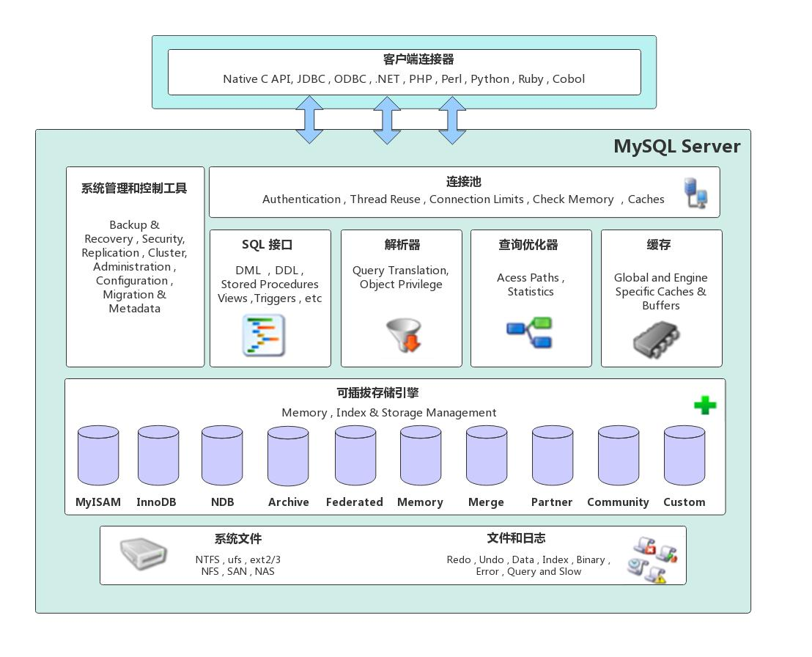

# MySQL

## 1. MySQL简介

市面上常用数据库有MySQL、Oracle、SQLServer等。其中，MySQL是免费的，在互联网公司中使用率非常高，社区活跃，且学习成本相对较低，同学们可以主要学习**MySQL数据库**。在完成MySQL学习后，其它数据库学习速度也会非常快。

## 2. MySQL安装与配置

[MySQL官方网站](https://www.mysql.com/cn/)

[MySQL安装教程（以Windows为例）](https://www.bilibili.com/video/BV1UE41147KC?spm_id_from=333.788.videopod.episodes&vd_source=bf13787311127d9efdb95deea8b81a48&p=4)

## 3. MySQL基本语法

针对MySQL，初级使用方面参考B站视频[MySQL基本教程](https://www.bilibili.com/video/BV1UE41147KC/?spm_id_from=333.1007.top_right_bar_window_custom_collection.content.click&vd_source=bf13787311127d9efdb95deea8b81a48)，主要理解并掌握下面思维导图内容即可。时间比较紧张的同学可以重点掌握**查询**、**连接**和**聚合函数**部分，面试重心放在MySQL底层原理和内部架构、数据结构上。

## 4. MySQL原理与进阶

掌握完MySQL基本语法后，进行MySQL原理的学习。这部分内容在面试中相对更加重要，学习顺序可以根据思维导图，从架构开始，按照逆时针顺序进行。

### 4.1 架构

推荐视频资料：

[MySQL架构](https://www.bilibili.com/video/BV1p5qhYsE4f/?spm_id_from=333.337.search-card.all.click&vd_source=bf13787311127d9efdb95deea8b81a48)

推荐博客资料：

[MySQL体系架构](https://blog.csdn.net/jonas80029735/article/details/148371890)

[深入浅出MySQL-架构与执行](https://www.cnblogs.com/novwind/p/17489997.html)

#### 4.1.1 Client层

​	Client层又叫连接层、客户端层，位于架构最上层。每一个客户端（如你的 mysql 命令行、Navicat、JDBC、Python 应用）想访问 MySQL 时，都会通过 TCP/IP 协议或 Unix socket 建立连接。每个连接在 Server 层会分配一个对应的线程。当客户端连接到 MySQL 服务端时，执行身份验证（用户名、密码）。**客户端把用户的SQL请求发送给 Server 层，真正的数据处理和优化都在后面做，完全不关心用的是什么存储引擎**。

#### 4.1.2 Server层

Server服务层位于架构中间层，主要分为以下功能模块：

**连接器**

​	Connectors组件是MySQL向外提供的交互组件，如java，go等语言可以通过该组件来操作SQL语句，实现与SQL的交互。为每个连接分配一个线程。

**查询缓存(MySQL 8.0 版本后移除)**

​	查询缓存主要用来缓存我们所执行的 SELECT 语句以及该语句的结果集。连接建立后，执行查询语句的时候，会先查询缓存，MySQL 会先校验这个 SQL 是否执行过，以 Key-Value 的形式缓存在内存中，Key 是查询语句，Value 是结果集。如果缓存 key 被命中，就会直接返回给客户端，如果没有命中，就会执行后续的操作，完成后也会把结果缓存起来，方便下一次调用。

​	但查询缓存失效在实际场景中可能会非常频繁，假如对一个表更新的话，这个表上的所有的查询缓存都会被清空。对于不经常更新的数据来说，使用缓存还是可以的。所以，一般在大多数情况下我们都是不推荐去使用查询缓存的。官方也是认为该功能在实际的应用场景比较少，所以MySQL 8.0 版本后干脆直接删除了缓存的功能。

**SQL 解析器（Parser）**

​	将用户提交的SQL字符串，按照MySQL的语法规则解析成语法树（Parse Tree）。会对SQL做初步的语法检查（是否有错别字、保留字冲突等）。如果语法错误，直接返回给Client层。

**查询优化器（Optimizer）**

​	解析后生成的语法树会交给优化器。选择最优的执行计划、选择用哪个索引、确定表连接顺序、生成成本最小的查询路径。

**查询执行器（Executor）**

​	根据优化器生成的执行计划，执行真正的操作。调用存储引擎 API 读写数据页、索引页，进行排序、分组、聚合、投影、过滤操作。期间会用到缓存（Buffer Pool）、临时表、排序区等资源。

#### 4.1.3 存储引擎层

​	存储引擎层位于架构最底层，负责**数据的真正读写和物理存储**，通过**Server 层** 提供的API调用，采用可以替换的插件式架构，支持 MyISAM、InnoDB、Memory 等多个存储引擎，不同引擎有不同的文件结构、索引方式、事务支持等。其中 InnoDB 引擎有自有的日志模块 redolog 模块。现在最常用的存储引擎是 InnoDB，它从 MySQL 5.5 版本开始就被当做默认存储引擎了。

​	需要注意的是，这些存储引擎，**它们之间并不是100%完全替代的关系，而是根据场景灵活选择**，在某些场景下使用InnoDB，在另外一些场景使用其它存储引擎。

推荐视频资料：

[MySQL存储引擎介绍与对比](https://www.bilibili.com/video/BV1D54y1G7ya/?spm_id_from=333.337.search-card.all.click&vd_source=bf13787311127d9efdb95deea8b81a48)

[MySQL存储引擎](https://www.bilibili.com/video/BV1iq4y1u7vj/?p=113&vd_source=894a223b85ae44e61e16dcd1a7356db0)

推荐博客资料：

[半道出家的InnoDB为何能替换官方的MyISAM？](https://juejin.cn/post/7160557698642083847)

**MyISAM**

MySQL 的一种经典存储引擎，是 MySQL 5.5 之前的默认存储引擎（现在默认是 InnoDB）。它是在 ISAM（Indexed Sequential Access Method）基础上改进来的，主要用于中小型应用，特点是**简单、读性能高、占用空间小**。

**InnoDB**

MySQL 默认且最常用的存储引擎，支持完整的 ACID 事务，采用行级锁和多版本并发控制（MVCC），因此在高并发场景下能保证数据一致性和高性能。同时，InnoDB 支持外键约束，具备崩溃恢复能力，通过 Buffer Pool 缓存数据页和索引页以提高 I/O 效率，内部使用聚簇索引结构让主键查询更高效。综合来看，InnoDB 特别适合对事务完整性要求高、读写并发多的生产环境。

**Memory**

将表数据完全存储在内存中，访问速度非常快，适合做临时表或缓存表。它支持哈希索引（默认），但不支持事务、外键和持久化，服务器重启或崩溃后数据会全部丢失，适用于需要高速读写、对数据持久性要求不高的场景。

以下表格是对常见的存储引擎做的简单对比：

| 存储引擎    | 是否支持事务 | 锁粒度      | 是否支持外键 | 索引类型         | 使用场景                                                     |
| ----------- | ------------ | ----------- | ------------ | ---------------- | ------------------------------------------------------------ |
| **InnoDB**  | ✅ 支持       | 行锁 + MVCC | ✅ 支持       | B+ 树            | 默认引擎，高并发，事务一致性要求高，OLTP 场景，如金融系统    |
| **MyISAM**  | ❌ 不支持     | 表级锁      | ❌ 不支持     | B+ 树            | 只读 / 读多写少，更新不频繁且对事务要求不高，如简单 CMS（内容管理、新闻站点） |
| **Memory**  | ❌ 不支持     | 表级锁      | ❌ 不支持     | 哈希索引         | 临时表、缓存表，高速读写但断电数据丢失                       |
| **Archive** | ❌ 不支持     | 行锁        | ❌ 不支持     | 无索引或简易索引 | 归档海量历史数据，几乎只插入不更新                           |

### 4.2 索引

#### 4.2.1 数据结构

#### 4.2.2 索引存储

#### 4.2.3 索引类型

### 4.3 事务

#### 4.3.1 事务四大特性

#### 4.3.2 事务并发问题

#### 4.3.3 事务隔离级别

#### 4.3.4 隔离级别实现

### 4.4 锁

#### 4.4.1 全局锁

#### 4.4.2 表级锁

#### 4.4.3 行级锁

#### 4.4.4 死锁

### 4.5 日志

#### 4.5.1 undo log

#### 4.5.2 redo log

#### 4.5.3 bin log

### 4.6 调优

#### 4.6.1 查询性能调优

#### 4.6.2 分页调优

#### 4.6.3 连接池

## 5. 面试题

