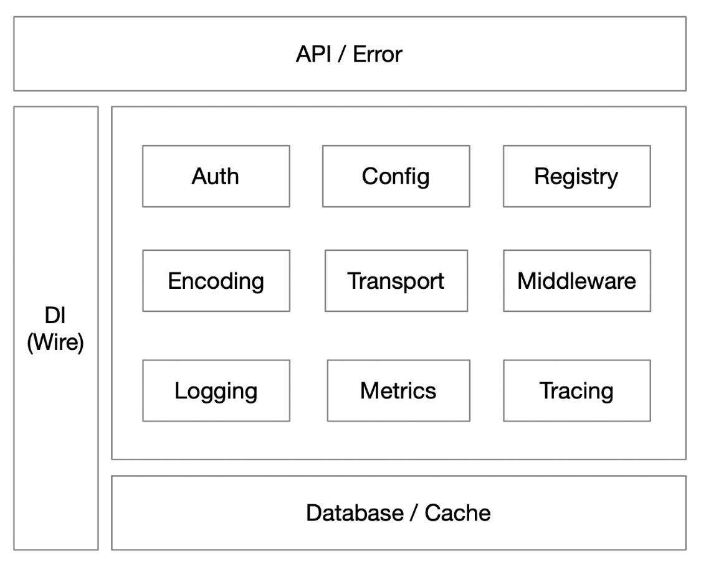
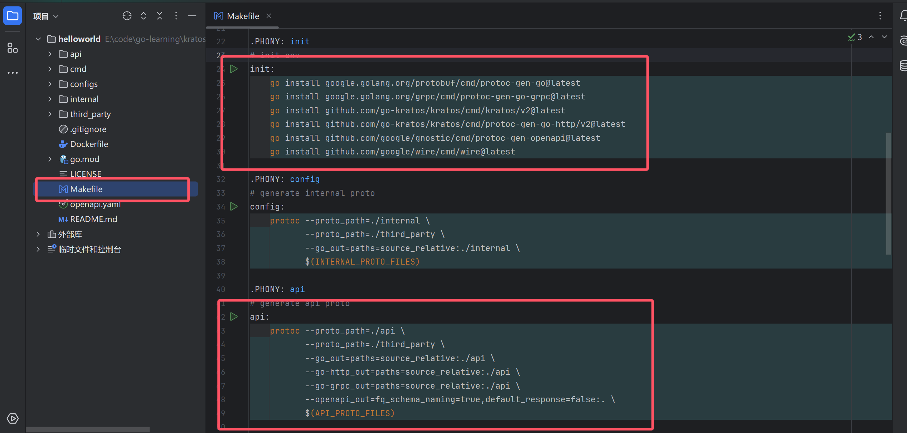

# Go

## 1. Go语言简介

Go 是由 **Google** 在 2007 年设计并于 2009 年开源发布的一种 **静态类型、编译型** 编程语言，设计目标是 **高效、简洁、并发友好**。语法类似 C，但更简洁，去除了复杂的特性，自动内存管理（垃圾回收 GC），采用 **Goroutine**（轻量级线程）和 **Channel**（通信机制）实现并发编程，比传统线程更高效。因此Go能适用于Web后台、数据库、区块链等众多场景，Go属于相对较新、发展前景很好的语言，大厂相关的招聘岗位也逐渐增加。

## 2. Go安装与开发环境配置

[Go安装包](https://go.dev/dl/)

**IDE**推荐使用**JetBrains**系列的 **[GoLand](https://www.jetbrains.com/go/promo/?source=google&medium=cpc&campaign=APAC_en_ASIA_GoLand_Branded&term=goland&content=546094953593&gad_source=1&gad_campaignid=10165081362&gbraid=0AAAAADloJzjuSZdYd7iq3-ndTIqNwPYeV&gclid=CjwKCAjwmenCBhA4EiwAtVjzmsQy6ms70b_4mvqHL-ceB_EAFpCzPrWGtTC1f6fCNy2Ydg9pjhKL9xoCsKYQAvD_BwE)** ，功能非常强大，并且开箱即用，海量插件扩展，生态完善。

## 3. Go语法与并发编程

### 3.1 语法基础

Go语言的语法相比较C++而言，简单一些，可以根据下面的思维导图进行快速学习，重点理解掌握**数组**、**切片**、**Map**以及**指针**的使用。



#### 结构体

和C、C++、Java等其它高级语言一样，go也定义了结构体，用于保存对象的多个不同数据类型的信息

结构体示例：

```go
package main

import "fmt"

type Teacher struct {
	ID      int
	Name    string
	Age     int
	Salary  float32
	Subject string
}

func main() {
	teacher := Teacher{
		ID:      10086,
		Name:    "hangman",
		Age:     28,
		Salary:  10000,
		Subject: "math",
	}
    
	fmt.Printf("老师：%v\n", teacher)
	fmt.Printf("老师的工资是：%.2f\n", teacher.Salary)
}
```

上述代码定义了一个Teacher类型的结构体，包含ID、Name、Age、Salary和Subject等属性。对这个结构体进行了初始化，以及访问内部数据的操作。

#### 数组

数组定义和初始化示例：

```go
package main

import "fmt"

func main() {
	// 定义一个长度为 5 的 int 数组，自动初始化为 0
	var array1 [5]int
	fmt.Println("array1:", array1)

	// 定义同时初始化
	var array2 = [5]int{1, 2, 3, 4, 5}
	fmt.Println("array2:", array2)

	// 使用 ... 让编译器推导长度
	array3 := [...]string{"Go", "Python", "Java"}
	fmt.Println("array3:", array3)

	// 部分初始化，未指定的元素默认为零值
	array4 := [5]int{1: 10, 3: 30}
	fmt.Println("array4:", array4) // [0 10 0 30 0]

	// 遍历数组
	for i, v := range array2 {
		fmt.Printf("index: %d, value: %d\n", i, v)
	}

	// 获取数组长度
	fmt.Println("Length of nums3:", len(array3))
}
```

#### 切片

切片定义和初始化示例：

```go
package main

import "fmt"

func main() {
	// 定义一个空切片
	var s1 []int
	fmt.Println("s1:", s1) // []

	// 初始化切片
	s2 := []int{1, 2, 3}
	fmt.Println("s2:", s2)

	// 使用 make 初始化（指定长度和容量）
	s3 := make([]int, 3, 5) // 长度 3，容量 5
	s3[0] = 10
	s3[1] = 20
	s3[2] = 30
	fmt.Println("s3:", s3)

	// 使用 append 动态追加元素
	s3 = append(s3, 40)
	s3 = append(s3, 50, 60) // 超过原容量，会自动扩容
	fmt.Println("s3 after append:", s3)

	// 从数组或切片切片
	arr := [5]int{100, 200, 300, 400, 500}
	s4 := arr[1:4]         // 不包含结束索引
	fmt.Println("s4:", s4) // [200 300 400]

	// 遍历切片
	for i, v := range s2 {
		fmt.Printf("index: %d, value: %d\n", i, v)
	}

	// 获取长度和容量
	fmt.Println("len(s3):", len(s3))
	fmt.Println("cap(s3):", cap(s3))
}
```

其中，切片可以通过make初始化，注意区别长度和容量。以s3为例，初始声明了长度为3，容量为5的切片。长度3是指当前能用的只有 `s3[0]` ~ `s3[2]`，如果你 `append` 两个元素，长度会变成 5，还不会重新分配内存。如果再 `append` 一个（超过 5），Go 会帮你分配一个更大的新底层数组（通常翻倍）。

#### Map

Map定义和初始化示例：

```go
package main

import "fmt"

func main() {
	// 定义一个空 map（key 是 string，value 是 int）
	var m1 map[string]int  // nil map
	fmt.Println("m1:", m1) // 输出：map[]

	// 使用 make 初始化
	m1 = make(map[string]int)
	m1["Alice"] = 90
	m1["Bob"] = 85
	fmt.Println("add m1:", m1)

	// 使用 字面量 初始化
	m2 := map[string]string{
		"apple":  "苹果",
		"banana": "香蕉",
	}
	fmt.Println("m2:", m2)

	// 查找元素，判断 key 是否存在
	score, ok := m1["Alice"]
	fmt.Println("Alice's score:", score, "exists?", ok)

	score2, ok2 := m1["Janny"] // Charlie 不存在
	fmt.Println("Janny:", score2, "exists?", ok2)

	// 删除元素
	delete(m1, "Bob")
	fmt.Println("deleted m1:", m1)

	// 遍历元素（无序）
	for k, v := range m2 {
		fmt.Printf("key: %s, value: %s\n", k, v)
	}

	// 获取长度
	fmt.Println("len(m1):", len(m1))
}
```

注：上述代码片段和文字只是简单介绍一下数组、切片和Map的基本使用，底层数据结构原理将在后续部分说明。

#### 指针

go语言指针定义和基本使用示例：

```go
package main

import "fmt"

func main() {
	// 定义一个 int 变量
	var num = 100
	fmt.Println("num:", num)

	// 定义一个指向 int 的指针，并用 & 取地址初始化
	var p *int
	p = &num
	fmt.Println("指针 p 的值（即 num 的地址）:", p)
	fmt.Println("通过指针 p 访问 num 的值:", *p)

	// 通过指针修改变量的值
	*p = 200
	fmt.Println("修改后 num:", num) // num 变成 200

	// 使用 new 关键字创建指针
	p2 := new(int) // p2 是 *int，new 返回的是指针
	*p2 = 300
	fmt.Println("p2 的值:", *p2)

	// 指针可以为 nil
	var p3 *string
	fmt.Println("未初始化的指针 p3:", p3)
	if p3 == nil {
		fmt.Println("p3 是 nil")
	}

	// 指针数组示例
	nums := [3]int{10, 20, 30}
	ptrs := [3]*int{&nums[0], &nums[1], &nums[2]}
	for i, p := range ptrs {
		fmt.Printf("index: %d, value: %d\n", i, *p)
	}
}
```

#### 条件语句

**if-else语句**

```go
package main

import "fmt"

func main() {
	age := 20

	if age >= 18 {
		fmt.Println("成年人")
	} else if age >= 13 && age < 18 {
		fmt.Println("青少年")
	} else {
		fmt.Println("儿童")
	}

	// if 语句还可以带初始化语句
	if score := 85; score >= 60 {
		fmt.Println("及格")
	} else {
		fmt.Println("不及格")
	}
}
```

**switch-case语句**

```go
package main

import "fmt"

func main() {
	grade := "B"

	switch grade {
	case "A":
		fmt.Println("优秀")
	case "B", "C":
		fmt.Println("良好")
	case "D":
		fmt.Println("及格")
	default:
		fmt.Println("不及格")
	}

	// switch 也可以不带表达式，写类似 if-else 的逻辑
	score := 75
	switch {
	case score >= 90:
		fmt.Println("优秀")
	case score >= 60:
		fmt.Println("及格")
	default:
		fmt.Println("不及格")
	}
}
```

#### 循环语句

go语言的循环不像其它语言一样有多种，比如c++有for，while，do-while。在go语言中循环就只有for一种，上手写起来非常的快。

```go
package main

import "fmt"

func main() {
	// 基本 for 循环
	for i := 0; i < 5; i++ {
		fmt.Println(i)
	}

	// 类似 while 的用法
	i := 0
	for i < 5 {
		fmt.Println(i)
		i++
	}

	// 遍历数组、切片
	arr := []string{"a", "b", "c"}
	for index, value := range arr {
		fmt.Println(index, value)
	}
}
```

#### 函数

```go
package main

import "fmt"

// Add 是一个普通函数，不属于任何类型
func Add(a int, b int) int {
	return a + b
}

func main() {
	// 使用函数
	sum := Add(3, 5)
	fmt.Println("Sum:", sum)
}
```

#### 方法

```go
package main

import "fmt"

// Rectangle 定义一个结构体
type Rectangle struct {
	Width  float64
	Height float64
}

// Area : 给 Rectangle 定义一个方法 Area
// 注意：方法有“接收者” (r Rectangle)
func (r Rectangle) Area() float64 {
	return r.Width * r.Height
}

// Scale : 使用指针接收传来的修改值
func (r *Rectangle) Scale(factor float64) {
	r.Width *= factor
	r.Height *= factor
}

func main() {
	// 使用结构体 + 方法
	rect := Rectangle{Width: 4, Height: 5}
	fmt.Println("Rectangle area:", rect.Area())

	// 调用指针方法，修改值
	rect.Scale(2)
	fmt.Println("Scaled rectangle area:", rect.Area())
}
```

#### 接口

```go
package main

import "fmt"

type Rectangle struct {
	Width  float64
	Height float64
}

type Circle struct {
	Radius float64
}

// Shape : 定义一个接口 Shape
type Shape interface {
	Area() float64
}

// Area : 给 Rectangle 定义一个方法 Area()
func (r Rectangle) Area() float64 {
	return r.Width * r.Height
}

// Area : Circle 也实现了 Area() 方法，所以满足 Shape 接口
func (c Circle) Area() float64 {
	return 3.1415 * c.Radius * c.Radius
}

func main() {
	// 使用接口
	var shape Shape

	rect := Rectangle{Width: 4, Height: 5}
	shape = rect // Rectangle 实现了 Shape 接口
	fmt.Println("Shape area (Rectangle):", shape.Area())

	circle := Circle{Radius: 3}
	shape = circle // Circle 也实现了 Shape 接口
	fmt.Println("Shape area (Circle):", shape.Area())
}
```

### 3.2 语法进阶与并发编程

#### 并发概述

要理解go语言的并发，首先需要理解清楚计算机操作系统中的**进程、线程、协程概念**和**并行与并发的区别**。

#### Goroutine

#### Channel

#### Sync

#### Select

#### Context

#### 定时器

#### 协程池

#### 反射

## 4. Go底层原理

### 4.1 设计模式

### 4.2 程序初始化

### 4.3 数据结构

### 4.4 协程调度

### 4.5 逃逸分析

### 4.6 Go语言垃圾回收

### 4.7 Go内存管理

## 5. 微服务框架与项目实践

### 5.1 go常用微服务框架

[go微服务框架对比](https://zhuanlan.zhihu.com/p/488233067)

### 5.2 kratos

**Kratos** 是由哔哩哔哩（Bilibili）开源的、面向微服务场景的 Go 语言框架，帮助开发者基于 Go 实现高可维护性、高性能和云原生友好的分布式系统。它集成了服务发现、配置管理、熔断、限流、链路追踪、日志等微服务常用能力，同时提供清晰的项目结构和代码生成工具。Kratos 广泛应用于高并发、高可用的互联网业务场景，是 Go 微服务领域较为成熟的工程化实践框架之一。

**Kratos快速入门应用学习资料**

[Kratos官方文档](https://go-kratos.dev/docs/)

[Kratos简介（视频）](https://www.bilibili.com/video/BV1xq4y1W78N?spm_id_from=333.788.videopod.episodes&vd_source=bf13787311127d9efdb95deea8b81a48)

[Kratos源码（github）](https://github.com/go-kratos/kratos)

#### 5.2.1 Kratos架构



API：HTTP/JSON、GRPC/Protobuf

Error：枚举

DI：依赖注入（类似于Java Spring里面的依赖注入）

Auth：鉴权，流量的入口处，可以去拦截非正常请求

Config：配置相关，和数据源打交道，比如MySQL，Redis

Registry：注册中心，和服务的注册及发现有关

Encoding：内容编码，传输内容的编码格式是什么样子的，比如UTF-8、GBK

Transport：HTTP/GRPC的传输层。

Middleware：中间件中间层，主要起拦截的作用（类似于Java的切面）

Logging：日志相关

Metrics：指标监控，比较主流的是Prometheus。可以用来监控CPU、内存等

Tracing：链路追踪

Database/Cache：数据库和缓存

#### 5.2.2 Kratos项目搭建

**1. 安装 kratos**

下面是比较简短的拉取并启动一个Kratos项目的脚本，更详细的命令和介绍可以阅读上述的Kratos官方文档。

> **启动Go官方依赖管理**
>
> go env -w GO111MODULE=on

> **配置代理（常用于国内用户网络限制）**
>
> go env -w GOPROXY=https://goproxy.cn,direct

> **CLI工具**
>
> go install github.com/go-kratos/kratos/cmd/kratos/v2@latest

>**查看Kratos版本**
>
>kratos --version

上述kratos CLI安装成功之后，会显示当前全局的kratos版本，一般是 v2.xx。需要注意的是，CLI 工具版本和你项目中的框架版本可以不一样

**2. Kratos CLI创建项目**

> kratos new helloworld

上述命令行成功执行之后，会出现一个 `helloworld` 项目，首先要做的就是简单了解一下kratos搭建的项目目录结构。


```bash
helloworld/
├── api/                  # Protocol Buffers 接口定义
│   └── helloworld/       # 当前服务的 proto 定义
│       ├── v1/
│       │   ├── greeter.proto           # 描述服务、方法、请求与响应结构,编译后会生成.pb.go文件
│       │   ├── greeter.pb.go
│       │   ├── greeter_grpc.pb.go
│       │   ├── greeter_http.pb.go
│       │   └── error_reason.proto      # 用于定义项目中统一的错误码（枚举）
│       │   └── error_reason.pb.go
├── cmd/                  # 启动入口，支持多个服务或进程
│   └── helloworld/       # helloworld 服务启动入口（main 函数在这里）
│       ├── main.go
│       ├── wire.go       # 实现依赖注入（DI）用于将组件（如 repo、usecase、service）注入到主程序
│       ├── wire_gen.go   # wire 自动生成 wire_gen.go，实现实际构造
├── configs/              # 配置文件
│   ├── config.yaml       # 配置HTTP、gRPC服务端口、数据库（mysql、redis）等
├── internal/             # 服务内部逻辑（核心目录）
│   ├── biz/              # 业务逻辑层（领域逻辑、UseCase）
│   ├── data/             # 数据访问层（如数据库、缓存、API 调用）
│   └── server/           # 服务启动配置（注册 gRPC/HTTP server）
│   ├── service/          # gRPC/HTTP 处理层（controller）
├── third_party/          # 第三方库
├── Dockerfile                          
├── go.mod                # Go module 定义
└── Makefile              # kratos make自动化脚本
├── README.md
```

**3. 安装系列工具插件**

需要注意的是，为了提高开发效率，往往还需要安装各种编译工具，下面简单列出了需要安装配置的工具。

- **protoc**：Protocol Compiler是 **Protocol Buffers 的编译器**，通俗来讲就是一个命令行工具，用于将 `.proto` 文件编译成目标语言（如 Java、Python、Go 等）的源代码文件，供程序直接使用。以下是protoc安装与使用的一些资料，需要到官方的release仓库找到对应的包，解压缩后配置环境变量。

[protoc官方仓库](https://github.com/protocolbuffers/protobuf/releases)

[protoc安装配置教程](https://blog.csdn.net/m0_57836225/article/details/147933580)

- **protoc-gen-go** ：用于 Go语言 的 Protocol Buffers 代码生成插件，它配合 `protoc` 使用，将 `.proto` 文件编译成 Go 语言的 `.pb.go` 源代码文件（结构体、序列化等）

>go install google.golang.org/protobuf/cmd/protoc-gen-go@latest

- **protoc-gen-go-grpc**：用于生成 gRPC 客户端、服务端接口代码

>go install google.golang.org/grpc/cmd/protoc-gen-go-grpc@latest
>
>go install github.com/go-kratos/kratos/cmd/protoc-gen-go-http/v2@latest

- **wire**：是 Google 的一个依赖注入代码生成工具。运行后自动帮你生成正确的 `wire_gen.go` 文件

>go install github.com/google/wire/cmd/wire@latest

tips：上面的 `protoc-gen-go` 、`protoc-gen-go-grpc` 和 `wire` 等插件一般可以使用 `make init` 全部安装。可以参考 [Kratos如何构建自动化脚本？](#Q4. Kratos如何构建自动化脚本？)

**4. 运行项目**

> kratos run

可以看到 helloworld 项目中默认写好了一个http服务，端口号是8000。启动成功之后，在本地浏览器中输入 `127.0.0.1:8000//helloworld/message`，浏览器能正常显示，就代表服务成功跑起来。接下来根据需求在项目的对应目录添加代码和业务逻辑即可。

#### 5.2.3 Kratos常见问题

##### **Q1. Kratos常用通信协议有哪些，它们之间有什么区别?**

在 Go 的 Kratos 框架中，`http` 和 `grpc` 是两种常见的服务通信协议。

 **HTTP/RESTful API**

- 基于 HTTP/1.1 或 HTTP/2，使用 JSON 数据格式
- 易于使用，适合对外提供开放 API

**gRPC（Google Remote Procedure Call）**

Kratos 默认首推的通信协议。

- 基于 HTTP/2，支持双向流、流控、Header 压缩
- 使用 Protocol Buffers（.proto）定义服务接口和消息格式
- 高性能、强类型，适用于微服务之间的高效通信

- 内置 `proto` 文件编译、服务生成、注册发现等完整支持
- 常用于服务间内部通信

下表是这两种常用服务的对比：

| 特性                  | HTTP（REST）                    | gRPC（RPC）                      |
| --------------------- | ------------------------------- | -------------------------------- |
| **协议**              | HTTP/1.1                        | HTTP/2（支持流式传输）           |
| **接口定义**          | 手动写路由和 handler            | 使用 `.proto` 文件生成代码       |
| **传输格式**          | JSON                            | Protobuf（二进制，更小更快）     |
| **调试便利性**        | 非常方便（浏览器/curl/Postman） | 较麻烦，需要 grpcurl / grpcui 等 |
| **性能**              | 一般                            | 更高效，延迟低                   |
| **服务发现/负载均衡** | 手动或借助外部工具              | 支持内建负载均衡 + 服务发现      |
| **流式通信**          | 不支持                          | 支持双向流（streaming）          |
| **使用场景**          | 对外开放API                     | 微服务间通信                     |

也就是说，当用户直接调用/需要对外提供服务的时候，使用HTTP协议；微服务之间调用/内部服务的时候，使用gRPC协议，常用于对性能要求高，数据量大的时候。

##### **Q2. protobuf是什么？有什么优点？**

Protocol Buffer（简称 **[Protobuf](https://blog.csdn.net/zhangzehai2234/article/details/134452936?ops_request_misc=%257B%2522request%255Fid%2522%253A%25222bb0e03cee863a70cdec679e49491493%2522%252C%2522scm%2522%253A%252220140713.130102334..%2522%257D&request_id=2bb0e03cee863a70cdec679e49491493&biz_id=0&utm_medium=distribute.pc_search_result.none-task-blog-2~all~top_click~default-1-134452936-null-null.142^v102^pc_search_result_base8&utm_term=Protocol%20Buffers&spm=1018.2226.3001.4187)** ）是Google开发的一种高效、语言中立、平台中立的**序列化数据格式**。可以将protobuf理解为一种类似于 JSON、XML 的数据结构描述语言，但**体积更小、速度更快、跨语言支持更强**。

把它想象成一个超级高效的快递打包员。在软件开发中，我们经常需要在不同模块、不同服务之间传递数据，就像在城市中运送包裹。传统的数据格式（如 XML、JSON）虽然也能完成任务，但是可能会比较 “臃肿”，传递起来效率不高。而 protoc 就像是一个更专业的打包员，能把数据打包得又小又规整，让数据在网络上传输得更快，存储时占用的空间也更小。常配合 gRPC 使用，负责数据结构的定义与编译生成代码。下表是更加详细一些的总结：

| 优点         | 说明                                           |
| ------------ | ---------------------------------------------- |
| 🧊 体积小     | 二进制格式，远小于 JSON 或 XML                 |
| ⚡ 速度快     | 编解码效率高，适合高性能系统                   |
| 🌐 跨语言     | 支持 C++, Java, Go, Python, Rust 等            |
| 🧩 可向后兼容 | 可以添加新字段而不影响旧代码（只要编号不冲突） |

##### Q3. go常用的环境变量配置

`GOROOT` — Go 的安装目录，通常默认为 C:/Program Files/Go

>go env GOROOT

`GOPATH` — 你的工作空间目录（源码、包、二进制默认存放处）,通常默认为 C:\Users\Mr.L\go

>go env GOPATH

`GOBIN` — 默认是 `GOBIN = $GOPATH/bin`，即可执行文件默认会放到 `GOPATH/bin` 目录

>go env GOBIN

可以选择自定义修改一下GOPATH环境变量，避免大量包/插件默认安装在C盘

##### Q4. Kratos如何构建自动化脚本？

在 Kratos 项目中，自动化构建脚本主要使用 **Makefile**，同时也可以结合 Shell 脚本、Go 脚本和 CI 工具链来完成更复杂的构建流程。下面简单介绍一下Makefile以及 **Make** 工具如何配置使用，考虑到大家在学习阶段开发环境使用windows比较多，下面配置示例以windows为主。（linux和mac配置比较简单，并且往往不会遇到比较麻烦的问题，不再进行详细介绍）

当我们使用 `kratos new helloworld` 之后，可以看到在目录中会出现一个Makefile文件，打开后可以看到有诸如 `make init` 、`make api` 等等命令。



这些命令可以理解为多个protoc命令的集合，使用Make工具，我们就可以一次性执行多条protoc编译指令，而不用每次都逐条运行，从而提高开发打包效率。要想成功运行，首先需要 **[安装Make工具](https://javapub.blog.csdn.net/article/details/148388941?spm=1001.2101.3001.6650.4&utm_medium=distribute.pc_relevant.none-task-blog-2~default~YuanLiJiHua~Position-4-148388941-blog-116751666.235%5Ev43%5Epc_blog_bottom_relevance_base2&depth_1-utm_source=distribute.pc_relevant.none-task-blog-2~default~YuanLiJiHua~Position-4-148388941-blog-116751666.235%5Ev43%5Epc_blog_bottom_relevance_base2&utm_relevant_index=8)** 。这里我们推荐使用 Chocolatey 安装 GNU Make。可以在命令行查看到make版本就代表安装成功。在这里有两个需要注意的地方。

**Windows 并不自带 make 命令**。命令提示符 cmd 和 PowerShell 不支持 `Makefile` 语法。如果你直接在cmd或 PowerShell 中运行 `make`，通常会报错。而 Git Bash 提供了类 Unix 环境，支持 `make` 工具的运行。这里需要将 kratos 项目自动生成的 Makefile 开头的一段代码修改为下面所示，然后我们直接用 `git bash` 运行诸如 `make api` 等命令即可。

```go
ifeq ($(GOHOSTOS), windows)
	#the `find.exe` is different from `find` in bash/shell.
	#to see https://docs.microsoft.com/en-us/windows-server/administration/windows-commands/find.
	#changed to use git-bash.exe to run find cli or other cli friendly, caused of every developer has a Git.
	#Git_Bash= $(subst cmd\,bin\bash.exe,$(dir $(shell where git)))

#	Git_Bash=$(subst \,/,$(subst cmd\,bin\bash.exe,$(dir $(shell where git))))
#	INTERNAL_PROTO_FILES=$(shell $(Git_Bash) -c "find internal -name *.proto")
#	API_PROTO_FILES=$(shell $(Git_Bash) -c "find api -name *.proto")

	INTERNAL_PROTO_FILES=$(shell find internal -name "*.proto")
	API_PROTO_FILES=$(shell find api -name "*.proto")
```

##### Q5. 后端接口如何进行快捷测试？

**Swagger UI**：是一个基于网页的用户界面，它能根据 **OpenAPI文档** 自动生成接口文档和测试页面。在 kratos 中 配置 Swagger UI + 生成 OpenAPI 文档方法如下。

1. 安装 `protoc-gen-openapi` 和 `protoc-gen-go-http` 插件（一般在 `make init` 这一步会默认安装好）

   >go install github.com/google/gnostic/cmd/protoc-gen-openapi@latest
   >
   >go install github.com/go-kratos/kratos/cmd/protoc-gen-go-http/v2@latest

2. 编写 .proto 文件，定义好要设计的接口和每个接口相应的 `request message `、 `reply message` 。

3. 执行 `make api` 指令，成功执行后，会生成一系列的 `.pb.go` 文件和 `openapi.yaml` 。

4. 前往 [swagger-ui官方仓库](https://github.com/swagger-api/swagger-ui)，执行下述命名，clone并打包生成html、css等静态资源。

   ```bash
   git clone https://github.com/swagger-api/swagger-ui.git
   npm install
   npm run build
   ```

5. build生成的资源在 `swagger-ui\dist` 目录下，将整个dist目录复制到我们的kratos项目中，按照以下目录组织。

   ```bash
   helloworld/
   ├── internal/
   │   └── swagger-ui/
   │       ├── dist/            # 3. 打包好的 swagger-ui 静态资源复制到这里
   │       │   ├── swagger-initializer.js  # 5. 修改根目录url
   │       ├── handler.go       # 4. 使用 embed 和 标准http 库实现 swagger-ui 服务
   │       ├── openapi.yaml
   │   └── server/
   │       ├── http.go          # 6. 注册 Swagger UI 服务
   ├── Makefile                 # 1. make api 生成 openapi.yaml
   ├── openapi.yaml             # 2. 默认生成位置，将它复制到 swagger-ui 目录下
   ```

   ```go
   // handler.go实现
   package swagger_ui
   
   import (
   	"embed"
   	"io/fs"
   	"net/http"
   )
   
   //go:embed dist/*
   var swaggerFiles embed.FS
   
   func Handler() http.Handler {
   	// 把 dist/ 子目录作为根路径暴露出来
   	distFS, err := fs.Sub(swaggerFiles, "dist")
   	if err != nil {
   		panic(err)
   	}
   	return http.StripPrefix("/swagger-ui/", http.FileServer(http.FS(distFS)))
   }
   
   //go:embed openapi.yaml
   var openapiFile embed.FS
   
   func HandlerOpenapi() http.Handler {
   	return http.FileServer(http.FS(openapiFile))
   }
   ```

   ```js
   // 修改 swagger-initializer.js
   // url: "https://petstore.swagger.io/v2/swagger.json",
   url: "/openapi.yaml",
   ```

   ```go
   // 注册 Swagger UI 服务
   srv := http.NewServer(opts...)
   v1.RegisterRealWorldHTTPServer(srv, greeter)
   
   srv.Handle("/openapi.yaml", swaggerui.HandlerOpenapi())
   srv.HandlePrefix("/swagger-ui/", swaggerui.Handler())
   ```

6. `kratos run` 执行成功后，访问 `http://127.0.0.1:8000/swagger-ui/`

```go
// Swagger UI 路由
router := mux.NewRouter()
router.PathPrefix("/q/").Handler(openapiv2.NewHandler())
```

6. `kratos run` 运行服务，并访问 `http://127.0.0.1:8000/openapi.yaml`  和 `http://127.0.0.1:8000/swagger-ui/`  ，出现下图所示代表搭建成功。

**Postman**：是一个功能强大的 **桌面应用程序（也有网页版）**，用于手动或自动测试 API。使用 Postman 调试接口方法如下。


实际开发中，通常用 `Swagger UI` 展示接口文档，给前端或产品经理看；用 `Postman` 进行更复杂的测试，包括带 token、复杂参数、调试等。

##### Q6. gorm是什么？如何使用？


### 5.3 活动抽奖系统

### 5.4 线上聊天论坛app

基于 **Go + Kratos + Gen + Grom** 实现线上聊天论坛app/小程序/网页端

[Kratos快速入门搭建项目（视频）](https://www.bilibili.com/video/BV1t3411h7uA/?spm_id_from=333.1007.top_right_bar_window_custom_collection.content.click&vd_source=bf13787311127d9efdb95deea8b81a48)

[Kratos快速入门项目源码（github）](https://github.com/gothinkster/realworld)

[TangSengDaoDaoServer源码（高颜值 IM 即时通讯,聊天）](https://github.com/TangSengDaoDao/TangSengDaoDaoServer)


## 6. 面试题库


