# Go

## 1. Go语言简介

Go 是由 **Google** 在 2007 年设计并于 2009 年开源发布的一种 **静态类型、编译型** 编程语言，设计目标是 **高效、简洁、并发友好**。语法类似 C，但更简洁，去除了复杂的特性，自动内存管理（垃圾回收 GC），采用 **Goroutine**（轻量级线程）和 **Channel**（通信机制）实现并发编程，比传统线程更高效。因此Go能适用于Web后台、数据库、区块链等众多场景，Go属于相对较新、发展前景很好的语言，大厂相关的招聘岗位也逐渐增加。

## 2. Go安装与开发环境配置

[Go安装包](https://go.dev/dl/)

**IDE**推荐使用**JetBrains**系列的**[GoLand](https://www.jetbrains.com/go/promo/?source=google&medium=cpc&campaign=APAC_en_ASIA_GoLand_Branded&term=goland&content=546094953593&gad_source=1&gad_campaignid=10165081362&gbraid=0AAAAADloJzjuSZdYd7iq3-ndTIqNwPYeV&gclid=CjwKCAjwmenCBhA4EiwAtVjzmsQy6ms70b_4mvqHL-ceB_EAFpCzPrWGtTC1f6fCNy2Ydg9pjhKL9xoCsKYQAvD_BwE)**，功能非常强大，并且开箱即用，海量插件扩展，生态完善。

## 3. Go语法与数据结构

### 3.1 语法基础

Go语言的语法相比较C++而言，简单一些，可以根据下面的思维导图进行快速学习，重点理解掌握**数组**、**切片**、**Map**以及**指针**的使用。



#### 结构体

和C、C++、Java等其它高级语言一样，go也定义了结构体，用于保存对象的多个不同数据类型的信息

结构体示例：

```go
package main

import "fmt"

type Teacher struct {
	ID      int
	Name    string
	Age     int
	Salary  float32
	Subject string
}

func main() {
	teacher := Teacher{
		ID:      10086,
		Name:    "hangman",
		Age:     28,
		Salary:  10000,
		Subject: "math",
	}
    
	fmt.Printf("老师：%v\n", teacher)
	fmt.Printf("老师的工资是：%.2f\n", teacher.Salary)
}
```

上述代码定义了一个Teacher类型的结构体，包含ID、Name、Age、Salary和Subject等属性。对这个结构体进行了初始化，以及访问内部数据的操作。

#### 数组

数组定义和初始化示例：

```go
package main

import "fmt"

func main() {
	// 定义一个长度为 5 的 int 数组，自动初始化为 0
	var array1 [5]int
	fmt.Println("array1:", array1)

	// 定义同时初始化
	var array2 = [5]int{1, 2, 3, 4, 5}
	fmt.Println("array2:", array2)

	// 使用 ... 让编译器推导长度
	array3 := [...]string{"Go", "Python", "Java"}
	fmt.Println("array3:", array3)

	// 部分初始化，未指定的元素默认为零值
	array4 := [5]int{1: 10, 3: 30}
	fmt.Println("array4:", array4) // [0 10 0 30 0]

	// 遍历数组
	for i, v := range array2 {
		fmt.Printf("index: %d, value: %d\n", i, v)
	}

	// 获取数组长度
	fmt.Println("Length of nums3:", len(array3))
}
```

#### 切片

切片定义和初始化示例：

```go
package main

import "fmt"

func main() {
	// 定义一个空切片
	var s1 []int
	fmt.Println("s1:", s1) // []

	// 初始化切片
	s2 := []int{1, 2, 3}
	fmt.Println("s2:", s2)

	// 使用 make 初始化（指定长度和容量）
	s3 := make([]int, 3, 5) // 长度 3，容量 5
	s3[0] = 10
	s3[1] = 20
	s3[2] = 30
	fmt.Println("s3:", s3)

	// 使用 append 动态追加元素
	s3 = append(s3, 40)
	s3 = append(s3, 50, 60) // 超过原容量，会自动扩容
	fmt.Println("s3 after append:", s3)

	// 从数组或切片切片
	arr := [5]int{100, 200, 300, 400, 500}
	s4 := arr[1:4]         // 不包含结束索引
	fmt.Println("s4:", s4) // [200 300 400]

	// 遍历切片
	for i, v := range s2 {
		fmt.Printf("index: %d, value: %d\n", i, v)
	}

	// 获取长度和容量
	fmt.Println("len(s3):", len(s3))
	fmt.Println("cap(s3):", cap(s3))
}
```

其中，切片可以通过make初始化，注意区别长度和容量。以s3为例，初始声明了长度为3，容量为5的切片。长度3是指当前能用的只有 `s3[0]` ~ `s3[2]`，如果你 `append` 两个元素，长度会变成 5，还不会重新分配内存。如果再 `append` 一个（超过 5），Go 会帮你分配一个更大的新底层数组（通常翻倍）。

#### Map

Map定义和初始化示例：

```go
package main

import "fmt"

func main() {
	// 定义一个空 map（key 是 string，value 是 int）
	var m1 map[string]int  // nil map
	fmt.Println("m1:", m1) // 输出：map[]

	// 初始化
	m1 = make(map[string]int)
	m1["Alice"] = 90
	m1["Bob"] = 85
	fmt.Println("add m1:", m1)

	// 用 make 初始化
	m2 := map[string]string{
		"apple":  "苹果",
		"banana": "香蕉",
	}
	fmt.Println("m2:", m2)

	// 查找元素，判断 key 是否存在
	score, ok := m1["Alice"]
	fmt.Println("Alice's score:", score, "exists?", ok)

	score2, ok2 := m1["Janny"] // Charlie 不存在
	fmt.Println("Janny:", score2, "exists?", ok2)

	// 删除元素
	delete(m1, "Bob")
	fmt.Println("deleted m1:", m1)

	// 遍历元素（无序）
	for k, v := range m2 {
		fmt.Printf("key: %s, value: %s\n", k, v)
	}

	// 获取长度
	fmt.Println("len(m1):", len(m1))
}
```

注：上述代码片段和文字只是简单介绍一下数组、切片和Map的基本使用，底层数据结构原理将在后续部分说明。

#### 指针

go语言指针定义和基本使用示例：

```go
package main

import "fmt"

func main() {
	// 定义一个 int 变量
	var num = 100
	fmt.Println("num:", num)

	// 定义一个指向 int 的指针，并用 & 取地址初始化
	var p *int
	p = &num
	fmt.Println("指针 p 的值（即 num 的地址）:", p)
	fmt.Println("通过指针 p 访问 num 的值:", *p)

	// 通过指针修改变量的值
	*p = 200
	fmt.Println("修改后 num:", num) // num 变成 200

	// 使用 new 关键字创建指针
	p2 := new(int) // p2 是 *int，new 返回的是指针
	*p2 = 300
	fmt.Println("p2 的值:", *p2)

	// 指针可以为 nil
	var p3 *string
	fmt.Println("未初始化的指针 p3:", p3)
	if p3 == nil {
		fmt.Println("p3 是 nil")
	}

	// 指针数组示例
	nums := [3]int{10, 20, 30}
	ptrs := [3]*int{&nums[0], &nums[1], &nums[2]}
	for i, p := range ptrs {
		fmt.Printf("index: %d, value: %d\n", i, *p)
	}
}
```

### 3.2 语法进阶


## 4. Go底层原理

## 5. 并发编程

## 6. Web端开发与微服务框架

## 7.面试题库

