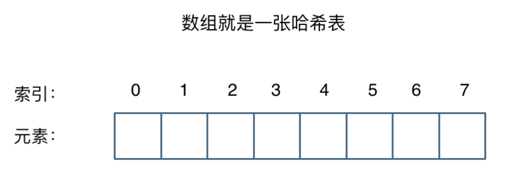
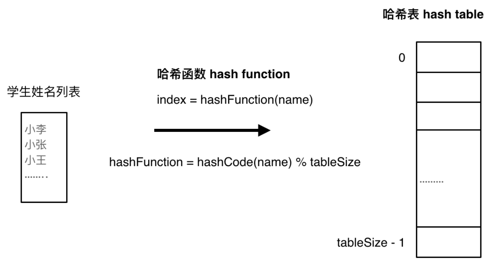

# LeetCode Hot 100

## 1. 刷题攻略

灵神（python）在B站

宫水三叶（java）在leetcode

代码随想录（B站）

## 2. 高频考点（AK）

**LeetCode Hot100 大厂面试刷题策略（华为/腾讯/字节6139篇面经统计）**

核心结论：Hot100 不要按默认顺序从头刷！按真实面试频次优先级刷题，10道高频题可以覆盖大量面试场景；**第 1 名 301 次**，**第 10 名仅仅 79 次**；**Top20 累计覆盖约 70% 手撕算法面试场景**。

数据来源：**汇总华为、腾讯、字节三家共 6139 篇 面试手撕面经**，重新统计 Hot100 真实考察频次

- Hot100 相关题：115道（含平台变体）
- 至少出现1次：81道（有真实频次数据）
- 三家样本中未出现：34道（备考优先级最低）
- 最高频次题目：无重复字符的最长子串（301次）
⚠️ 备注：样本中未出现 ≠ 完全不考，仅代表本次样本覆盖不足；其他公司考察分布可能不同

### 2.1 🏆 TOP 10｜时间紧张优先必刷清单（最高频）

只准备很短时间，优先攻克这10题

| 排名 | 题目 | 难度 | 出现次数 | 完成情况 |
| :--: | :--- | :--: | :--: | :--: |
| 🥇 1 | [无重复字符的最长子串](# ⭐⭐⭐⭐⭐ 无重复字符的最长子串  ✅😅) | 🟡 Medium | **301 次** | ✅ |
| 🥈 2 | [LRU 缓存](#13 ⭐⭐⭐⭐⭐⭐⭐LRU缓存 ✅😅) | 🟡 Medium | **226 次** | 🟠 |
| 🥉 3 | [数组中第 K 个最大元素](# ⭐⭐⭐⭐⭐ 数组中的第 K 个最大元素 ✅😅) | 🟡 Medium | **138 次** | 🟠 |
| 4 | [最大子数组和](# ⭐⭐⭐⭐最大子数组和✅😅) | 🟡 Medium | 117 次 | 🟠 |
| 5 | [反转链表](#4 ⭐⭐⭐反转链表 ✅✅😅) | 🟢 Easy | 112 次 | 🟠 |
| 6 | [最长递增子序列](# ⭐⭐⭐⭐⭐最长递增子序列 ✅😅) | 🟡 Medium | 107 次 | 🟠 |
| 7 | [有效的括号](# ⭐ ⭐有效的括号 ✅😅) | 🟢 Easy | 100 次 | 🟠 |
| 8 | [岛屿数量](#1 ⭐⭐⭐⭐⭐ 岛屿数量✅✅😅) | 🟡 Medium | 94 次 | 🟠 |
| 9 | [K 个一组翻转链表](#12 ⭐⭐⭐⭐⭐⭐⭐k个一组翻转链表 ✅😅) | 🔴 Hard | 82 次 | 🟠 |
| 10 | [三数之和](#38 ⭐⭐⭐⭐⭐ 三数之和  ✅😅) | 🟡 Medium | 79 次 | 🟠 |

重点观察：第1名考察频次 ≈ 第10名 × 4倍
建议：如果面试只能死磕1道题，优先刷【无重复字符的最长子串】；一面没写出来，二面很大概率继续考察。

### 2.2 🥈 TOP 11–20｜次优先级（2~3周备考加入）

刷完TOP 10后跟进这10题，TOP 20合计覆盖约70%手撕场景

| 排名 | 题目 | 难度 | 出现次数 | 完成情况 |
| :--: | :--- | :--: | :--: | :--: |
| 11 | 最长回文子串 | 🟡 Medium | 78 次 | 🟠 |
| 12 | [合并 K 个升序链表](#19 ⭐⭐⭐⭐⭐⭐合并 K 个升序链表 ✅😅) | 🔴 Hard | 74 次 | 🟠 |
| 13 | [合并区间](# ⭐⭐⭐⭐⭐合并区间✅😅) | 🟡 Medium | 73 次 | 🟠 |
| 14 | [删除链表的倒数第 N 个结点](#16 ⭐⭐⭐⭐删除链表的倒数第 N 个结点 ✅😅) | 🟡 Medium | 68 次 | 🟠 |
| 15 | 编辑距离 | 🟡 Medium | 64 次 | 🟠 |
| 16 | [接雨水](#39 ⭐⭐⭐⭐⭐⭐ 接雨水  ✅😅) | 🔴 Hard | 64 次 | 🟠 |
| 17 | [合并两个有序链表](#2 ⭐⭐⭐ 合并两个有序链表 ✅✅😅) | 🟢 Easy | 63 次 | 🟠 |
| 18 | [二叉树的层序遍历](#21 ⭐⭐⭐⭐⭐二叉树的层序遍历 ✅😅) | 🟡 Medium | 61 次 | 🟠 |
| 19 | [二叉树的最近公共祖先](# ⭐⭐⭐⭐⭐ 二叉树的最近公共祖先 ✅😅) | 🟡 Medium | 58 次 | 🟠 |
| 20 | [买卖股票的最佳时机](# ⭐⭐⭐ 买卖股票的最佳时机 ✅😅) | 🟢 Easy | 52 次 | 🟠 |

### 2.3 📚 TOP 21–50｜按章节系统刷题（30道，按算法模块攻坚）

链表、动态规划、二分查找三大模块考察最密集，优先攻克性价比最高

| 优先级 | 算法模块 | 题数 | 涉及题目 |
| :--: | :--- | :--: | :--- |
| ⭐⭐⭐ | 🔗 链表 | 5 道 | 环形链表、环形链表 II、相交链表、两数相加、排序链表 |
| ⭐⭐⭐ | 📊 动态规划 | 6 道 | 零钱兑换、最长公共子序列、爬楼梯、最长有效括号、分割等和子集、最小路径和 |
| ⭐⭐⭐ | 🔍 二分查找 | 4 道 | 搜索旋转排序数组、在排序数组中查找元素、寻找最小值、中位数 |
| ⭐⭐ | 🌲 二叉树 | 3 道 | 二叉树右视图、最大路径和、BST 第 K 小元素 |
| ⭐⭐ | 🔁 回溯 | 2 道 | 全排列、括号生成 |
| ⭐⭐ | 🪟 滑动窗口 | 2 道 | 滑动窗口最大值、最小覆盖子串 |
| ⭐⭐ | 🟦 矩阵 | 2 道 | 螺旋矩阵、搜索二维矩阵 II |
| ⭐ | 📦 数组 / 哈希 / 堆 | 3 道 | 两数之和、寻找重复数、前 K 个高频元素 |
| ⭐ | 📚 栈 | 2 道 | 字符串解码、最小栈 |
| ⭐ | 🕸️ 图 | 1 道 | 课程表 |

### 2.4 ❄️ 低频参考｜三家面经样本中频次为0的Hot100题目（放到最后刷）

时间极度紧张时，可以暂时后置
| 序号 | 第一组 | 第二组 |
| :--: | :--- | :--- |
| 1 | 移动零 | 字母异位词分组 |
| 2 | 只出现一次的数字 | 杨辉三角 |
| 3 | 完全平方数 | 跳跃游戏 II |
| 4 | 划分字母区间 | 柱状图中最大的矩形 |
| 5 | 搜索插入位置 | 搜索二维矩阵 |
| 6 | 分割回文串 | N 皇后 |
| 7 | 实现 Trie | 有序数组转 BST |
| 8 | 二叉树展开为链表 | 路径总和 III |
| 9 | 随机链表的复制 | 矩阵置零 |
| 10 | 除自身以外数组的乘积 | 找所有字母异位词 |

### 2.5 ⏱️ 不同备考时长刷题优先级方案

1. 1周以内：只刷 TOP 10，拿下最高频面试题
2. 2–3周：TOP20 + 链表/动态规划模块补齐，覆盖70%场景
3. 1个月以上：TOP50 + 按章节系统补齐
4. 时间充裕：Hot100 全部刷完，建立完整算法知识体系

❌ 常见失败踩坑：按LeetCode原生顺序从头刷（从两数之和开始），刷到一半时间耗尽，LRU、第K大元素、岛屿数量等高频题反而遗漏。

💡 额外重要提醒：ACM模式

字节、腾讯、拼多多等大厂手撕算法普遍采用 ACM模式（需要自己处理输入输出），和LeetCode默认核心代码模式不一样。

- 只刷LeetCode核心代码，上机现场容易翻车
- 建议：面试前用ACM模式完整过一遍高频Hot100题目

题库信息补充（AK机 Hot100 ACM模式题库）

题库基于近两年7000+大厂技术岗面经整理，按面试频次从高到低排序；支持ACM模式在线刷题，配套核心代码、ACM实现与在线评测。
题目总量：115题 | 累计练习次数：3074次


## 3. 高频考点（小红书博主）

1. [最长连续序列](#⭐⭐⭐⭐⭐ 最长连续序列  ✅😅) ✅✅1️⃣
2. [盛最多水的容器](#⭐⭐⭐⭐ 盛最多水的容器  ✅😅) ✅✅2️⃣
3. [三数之和](# ⭐⭐⭐⭐⭐ 三数之和  ✅😅) ✅✅2️⃣
4. [接雨水](# ⭐⭐⭐⭐⭐⭐ 接雨水  ✅😅)✅✅3️⃣
5. [无重复字符的最长子串](# ⭐⭐⭐⭐⭐ 无重复字符的最长子串  ✅😅) ✅✅1️⃣
6. [滑动窗口最大值](# ⭐⭐⭐⭐⭐⭐⭐滑动窗口最大值✅😅) ✅✅2️⃣
7. [最小覆盖子串](# ⭐⭐⭐⭐⭐⭐⭐最小覆盖子串✅😅) ✅✅3️⃣
8. [合并区间](# ⭐⭐⭐⭐⭐合并区间✅😅) ✅✅3️⃣
9. [搜索二维矩阵2](# ⭐⭐⭐⭐⭐ 搜索二维矩阵2  ✅😀) ✅ ✅3️⃣
10. [反转链表](# ⭐⭐⭐反转链表 ✅😅) ✅✅1️⃣
11. [两两交换链表中的节点](# ⭐⭐⭐⭐⭐两两交换链表中的节点 ✅😅) ✅✅4️⃣
12. [k个一组翻转链表](# ⭐⭐⭐⭐⭐⭐⭐k个一组翻转链表 ✅😅) ✅✅4️⃣
13. [二叉树的中序遍历](# ⭐⭐⭐二叉树的中序遍历 ✅😅) ✅✅1️⃣
14. [二叉树的最大深度](# ⭐⭐二叉树的最大深度 ✅😅) ✅✅1️⃣
15. [二叉树的层序遍历](# ⭐⭐⭐⭐⭐二叉树的层序遍历 ✅😅) ✅✅4️⃣
16. [二叉树的右视图](# ⭐⭐⭐⭐⭐二叉树的右视图 ✅😅) ✅✅4️⃣
17. [路径总和3](# ⭐⭐⭐⭐⭐路径总和3 ✅😅) ✅✅5️⃣
18. [二叉树的最近公共祖先](# ⭐⭐⭐⭐ 二叉树的最近公共祖先 ✅😅) ✅✅5️⃣
19. [岛屿数量](# ⭐⭐⭐⭐⭐ 岛屿数量✅😅) ✅✅✅1️⃣
20. [全排列](# ⭐⭐⭐⭐⭐ 全排列 ✅😅) ✅✅1️⃣
21. [子集](# ⭐⭐⭐⭐⭐ 子集 ✅😅) ✅✅5️⃣
22. [组合总和](# ⭐⭐⭐⭐⭐ 组合总和 ✅😅) ✅✅5️⃣
23. [搜索插入位置](# ⭐⭐ 搜索插入位置（二分查找）  ✅😀) ✅✅1️⃣
24. [打家劫舍](# ⭐⭐⭐⭐⭐打家劫舍 ✅😅) ✅✅1️⃣
25. [零钱兑换](# ⭐⭐⭐⭐⭐零钱兑换 ✅😅) ✅✅5️⃣
26. [最长递增子序列](# ⭐⭐⭐⭐⭐最长递增子序列 ✅😅) ✅✅6️⃣
27. [最小路径和](# ⭐⭐⭐ 最小路径和 ✅😅) ✅✅6️⃣
28. [最长公共子序列](# ⭐⭐⭐⭐⭐ 最长公共子序列 ✅😅) ✅✅6️⃣
29. [下一个排列](# ⭐⭐⭐⭐⭐⭐ 下一个排列 ✅😅) ✅✅6️⃣

1️⃣2️⃣3️⃣4️⃣5️⃣6️⃣7️⃣8️⃣9️⃣

## 4. 面经来源

1. [LRU缓存](#⭐⭐⭐⭐⭐⭐⭐LRU缓存 ✅😅) ✅1️⃣
2. [螺旋矩阵](# ⭐⭐⭐⭐⭐ 螺旋矩阵  ✅😀) ✅1️⃣

## 5. ACM常用处理函数

函数脚本头

```go
package main

import (
	"fmt"
    "os"
    "bufio"
    "strings"
    "strconv"
)
```

### 5.1 bufio

```go
import (
	"os"
    "bufio"
)

// 创建一个缓冲读取器，从标准输入中读取数据
reader := bufio.NewReader(os.Stdin)

line1, _ := reader.ReadString('\n')

line2, _ := reader.ReadString('\n')

line3, _ := reader.ReadString('\n')

// line1 := "5 9\n"
// line2 := "1 2 3 4 5\n"
// line3 := abcabcbb\n

// 去掉换行
s = strings.TrimSpace(s)

```

```go
scanner := bufio.NewScanner(os.Stdin)

scanner.Scan()

line := scanner.Text()
```

### 5.2 strings

```go
// strings.Fields 转为切片
desc := strings.Fields(line1)

numsStr := strings.Fields(line2)

// desc = []string{"5", "9"}
// numsStr = []string{"1", "2", "3", "4", "5"}
```

```go
// strings.Join 将字符串切片，拼接为字符串
// 只能为string，如果是int，要先strconv.Itoa()
res := []string{"5", "4", "3", "2", "1"}
s := strings.Join(res, " ")
fmt.Println(s)
```

```go
line, _ := reader.ReadString('\n')
line = strings.TrimSpace(line) // 去除换行符
matrix[i] = make([]byte, n)
for j := 0; j < n; j++ {
	matrix[i][j] = line[j]
}
```

### 5.3 strconv

```go
// strconv.Atoi  → ASCII to int
// strconv.Itoa  → int to ASCII

num, _ := strconv.Atoi(s)

s := strconv.Itoa(123)
```

### 5.4 fmt

```go
var n int
fmt.Scan(&n)
```

```go
fmt.Println(res[0], res[1])

fmt.Println(strings.Join(res, " "))
```

```go
var numsLen, target int

fmt.Fscan(os.Stdin, &numsLen, &target)

nums := make([]int, numsLen)
for i := 0; i < numsLen; i++ {
    fmt.Fscan(os.Stdin, &nums[i])
}
```

### 5.5 sort

```go
// 把 nums 这个整型切片按从小到大排序（升序）
sort.Ints(nums)

// sort.Slice 可以对任何 slice 排序，你只需要告诉它："什么叫前面，什么叫后面"
sort.Slice(arrs, func(i, j int) bool{
    return customMoreLittle(arrs[i], arrs[j])
})
```

### 5.6 rand

```go
import (
	"math/rand"
)

rand.Seed(time.Now().UnixNano())

pivotIndex := left + rand.Intn(right - left + 1)
```

### 5.7 math

```go
import (
	"math"
)

// 计算平方根，判断是否是完全平方数
func check(x int64) bool {
    // math.Sqrt
    root := int64(math.Sqrt(float64(x)))
    
    // math.Pow
    root := int64(math.Pow(float64(x), 0.5))

    return root*root == x
}
```

### 5.8 常用数据结构的构造方式

```go
// 单链表

// 二叉树

// 二维矩阵


```


## 6. 题库

### 6.1 哈希（3）

#### 哈希表理论基础

哈希表（Hash table），国内也有一些数据结构书籍翻译为散列表。哈希表是根据关键码的值而直接进行访问的数据结构。直白来讲其实数组就是一张哈希表。哈希表中关键码就是数组的索引下标，然后通过下标直接访问数组中的元素。



**一般哈希表都是用来快速判断一个元素是否出现集合里。**

例如要查询一个名字是否在这所学校里。要暴力枚举的话时间复杂度是O(n)，但如果使用哈希表的话， 只需要O(1)就可以做到。我们只需要初始化把这所学校里学生的名字都存在哈希表里，在查询的时候通过索引直接就可以知道这位同学在不在这所学校里了。

将学生姓名映射到哈希表上就涉及到了**hash function ，也就是哈希函数**。



#### 常见的哈希结构

在C++中，常见的哈希数据结构有 **数组、Set、Map** 这三种，底层原理和时间复杂度会有略微的区别，但整体都是基于哈希表/红黑树实现，对应的时间复杂度为O(1) / O(log n)。不同语言提供的内置哈希结构会有所差异，比如Go语言常用的Hash结构为 **Map** 。如果要详细了解不同语言（如C++、Java、Go...）所提供的哈希数据结构细节，可以分别查看对应的编程语言学习模块，进行详细了解。

#### Hot 100 例题

##### ⭐ 两数之和  ✅😅

错误解法：暴力解决，但是会超时

```go
func twoSum(nums []int, target int) []int {
    // 直接两个for循环暴力解，时间复杂度O(n^2)
	for i := 0; i < len(nums); i++ {
        for j := i + 1; j < len(nums); j++ {
            a := nums[i]
            b := nums[j]
            sum := a + b
            fmt.Println(sum)
            if sum == target {
                return []int{i, j}
            }
        }
	}
    return []int{}
}
```

标准正确解法：使用Hash Map

```go
func twoSum(nums []int, target int) []int {
    // 初始化一个空的 hash map
    hash := make(map[int] int)
    for i, num := range nums {
        sub := target - num
        // 核心逻辑，判断hash map中是否已经存了一个数字，能够满足 该数字 + num = target
        // 若满足，则直接返回两个数字对应的数组下标
        if j, is_exists := hash[sub]; is_exists {
            return []int{j, i}
        }
        // 不满足，则继续向hash map中添加num
        hash[num] = i
    }
    return nil
}
```

##### ⭐⭐⭐⭐⭐ 最长连续序列  ✅😅

```go
func longestConsecutive(nums []int) int {
    if len(nums) == 0 {
        return 0
    }

    // 创建hash集合，同时去重
    hash := make(map[int]bool)
    for _, num := range nums {
        hash[num] = true
    }

    maxLensStreak := 0

    for num := range hash {
        // 只从可能的起点开始检查
        if !hash[num-1] {
            currentNum := num
            currentLensStreak := 1

            // 向上查找连续的数字
            for hash[currentNum+1] {
                currentNum++
                currentLensStreak++
            }

            // 更新最长序列长度
            if currentLensStreak > maxLensStreak {
                maxLensStreak = currentLensStreak
            }
        }
    }

    return maxLensStreak
}
```


### 6.2 双指针（4）

#### Hot 100 例题

##### 36. ⭐ 移动零  ✅😅

```go
func moveZeroes(nums []int)  {
    // 双指针实现（非交换）：不使用额外数组，直接在原数组上进行修改
    i := 0
    for j := 0; j < len(nums); j++ {
        // 寻找非0元素，i指针代表遍历过的非0元素个数，j指针代表遍历到了元素的哪个位置
        if nums[j] != 0 {
            nums[i] = nums[j]
            i++
        }
    }
    
    // 将剩余数组空间全部填0
    for i < len(nums) {
        nums[i] = 0
        i++
    }
}
```

```go
func moveZeroes(nums []int)  {
    // 双指针实现（0元素和非0元素进行交换）：不使用额外数组，直接在原数组上进行修改
    i := 0
    for i < len(nums) {
        if nums[i] == 0 {
            // 找右边第一个不为0的元素
            j := i + 1
            for j < len(nums) && nums[j] == 0 {
                j++
            }
            
            // 右边全是0，直接结束
            if j == len(nums) {
                return
            }
            
            nums[i], nums[j] = nums[j], nums[i]
        }
        i++
    }
}
```

##### 37. ⭐⭐⭐⭐ 盛最多水的容器  ✅😅

```go
func maxArea(height []int) int {
    left, right := 0, len(height) - 1
    maxArea := 0

    for left < right {
        // 计算当前水量
        width := right - left
        h := height[left]
        if height[right] < h {
            h = height[right]
        }

        area := width * h
        if area > maxArea {
            maxArea = area
        }

        // 移动较短的那条线
        if height[left] < height[right] {
            left++
        } else {
            right--
        }
    }

    return maxArea
}
```

##### 38. ⭐⭐⭐⭐⭐ 三数之和  ✅😅

````go
```
核心思想：
	1. 先排序
	2. 固定一个数 nums[i]
	3. 用双指针在后面找 -nums[i]
关键点：去重！！！
时间复杂度：O(n²)
空间复杂度：O(1)

为什么会有重复？
假设输入数组：[-1, 0, 1, 2, -1, -4]
排序后：[-4, -1, -1, 0, 1, 2]

不去重的情况：

当 i = 1 (指向第一个-1) 时，会找到 [-1, 0, 1]

当 i = 2 (指向第二个-1) 时，又会找到 [-1, 0, 1]

这样结果中就会出现两个 [-1, 0, 1]，这不符合题目要求。
​```
import (
    "fmt"
    "sort"
)

func threeSum(nums []int) [][]int {
    results := [][]int{}

    sort.Ints(nums)
    n := len(nums)

    // i < n 和 i < n-2 都可以，都不会出错
    for i:= 0; i < n; i++ {
    // for i:= 0; i < n-2; i++ {
        // 如果排序后的第一个元素都大于0，那么后面求和不可能等于0
        if nums[i] > 0 {
            break
        }

        // 去重: 跳过相同的起始值
        if i > 0 && nums[i] == nums[i-1] {
            continue
        }

        left, right := i+1, n-1

        // 双指针
        for left < right {
            sum := nums[i] + nums[left] + nums[right]

            if sum == 0 {
                results = append(results, []int{nums[i], nums[left], nums[right]})

                // 去重: 跳过左边的重复值
                for left < right && nums[left] == nums[left+1] {
                    left++
                }

                // 去重: 跳过右边的重复值
                for left < right && nums[right] == nums[right-1] {
                    right--
                }

                left++
                right--

            } else if sum < 0 {
                left++
            } else {
                right--
            }
        }
    }

    return results
}
````

##### 39. ⭐⭐⭐⭐⭐⭐ 接雨水  ✅😅

````go
```
使用左右两个指针从两端向中间移动
每次移动较矮的一边，因为较矮的一边决定了能接多少水
​```
func trap(height []int) int {
    if len(height) == 0 {
        return 0
    }

    left, right := 0, len(height)-1
    leftMax, rightMax := 0, 0
    rain := 0

    for left < right {
        if height[left] < height[right] {
            if height[left] > leftMax {
                leftMax = height[left]
            } else {
                rain += leftMax - height[left]
            }
            left++
        } else {
            if height[right] > rightMax {
                rightMax = height[right]
            } else {
                rain += rightMax - height[right]
            }
            right--
        }
    }

    return rain
}
````


### 6.3 滑动窗口（2）

#### Hot 100 例题

##### ⭐⭐⭐⭐⭐ 无重复字符的最长子串  ✅😅

```go
// 时间复杂度 O(n)
// 空间复杂度 O(k)

func lengthOfLongestSubstring(s string) int {
    // 记录字符最后出现的位置
    lastseen := make(map[byte]int)
    
    left := 0
    maxlen := 0

    for right := 0; right < len(s); right++ {
        ch := s[right]
        
        // 如果当前位置的这个字符存在 lastseen 中，并且它的位置是在起点的后面，说明它出现过
        // 此时，移动窗口起点到重复字符的下一个位置
        if pos, exists := lastseen[ch]; exists && pos >= left {
            left = pos + 1
        }
        
        // 更新 map，因为当前字符必须先加入窗口，再计算窗口长度
        lastseen[ch] = right
		
        // 更新当前窗口长度，其实不管怎么走，right 都一定是窗口的 "end"
        currentlen := right - left + 1
        if currentlen > maxlen {
            maxlen = currentlen
        }
    }
    return maxlen
}
```

##### 找到字符串中所有字母异位词 ❌😅

### 6.4 子串（3）

##### ⭐⭐⭐⭐⭐⭐⭐滑动窗口最大值✅😅

````go
```
最优解法，时间复杂度 $O(n)$。
核心思想：维护一个单调递减的双端队列（Double End Queue）
	队首始终是当前窗口的最大值。
	队列中存储的是元素的索引，队列对应的元素值单调递减。
规则：
	队首维护：如果队首索引已不在当前窗口内（i - queue[0] >= k），则弹出队首
	队尾维护：新元素入队前，从队尾弹出所有比它小的元素索引（因为这些元素不可能成为后面窗口的最大值）
	队尾入队：将当前元素索引加入队尾
	记录结果：当窗口形成后（i >= k-1），队首对应的元素就是当前窗口的最大值
​```
func maxSlidingWindow(nums []int, k int) []int {
    n := len(nums)
    if n == 0 || k == 0 {
        return []int{}
    }
	
    // 最终返回的结果，大小为n-k+1，这个储存的才是值
    results := make([]int, n-k+1)
    // 维护一个单调递减的双端队列，并且这个双端队列存储的是元素的位置索引，而不是值
    deque := make([]int, 0)

    for i := 0; i < n; i++ {
        // 队首元素出队
        // 把队首不在当前这个窗口的元素弹出
        // 相当于这个滑动窗口，走过 deque[0] 这个索引了
        if len(deque) > 0 && deque[0] < i-k+1 {
            deque = deque[1:]
        }

        // 队尾元素出队
        // 遍历这个队列，把队尾所有小于当前元素的索引，全部弹出
        // 因为这些元素不可能成为后面窗口的最大值
        // 这个一定要 for，不能 if
        // 第一个才是 if
        for len(deque) > 0 && nums[deque[len(deque)-1]] < nums[i] {
            deque = deque[:len(deque)-1]
        }

        // 当前索引入队
        deque = append(deque, i)

        // 队首元素加入results
        // 从第k-1个元素开始，窗口形成
        // 假设 n = 8, k = 3, 也就是说，窗口从 i = 2 的时候形成
        if i >= k-1 {
            results[i-k+1] = nums[deque[0]]
        }
    }

    return results
}
````

##### ⭐⭐⭐⭐⭐⭐⭐最小覆盖子串✅😅

```go
func minWindow(s string, t string) string {
    m, n := len(s), len(t)
    if m == 0 || n == 0 || m < n {
        return ""
    }

    // 用hash统计 t 中每个字符的需求量
    need := make(map[byte]int)
    for i := 0; i < len(t); i++ {
        need[t[i]]++
    }

    left, right := 0, 0
    // 注意，这个 minLen 一定是 len(s)+1，直接len(s)会有问题
    minStart, minLen := 0, len(s)+1
    // 还需要匹配的字符总数
    count := len(t)

    window := make(map[byte]int)

    for right < len(s) {
        // 1. 把当前ch加入到窗口
        ch := s[right]
        window[ch]++

        // 需要ch && 当前窗口内的ch数量没满足需求
        // 说明上面添加ch有效，也就是的确需要添加ch，此时count--
        if need[ch] > 0 && window[ch] <= need[ch] {
            count--
        }

        // 注意，这里一定是 left <= right
        for count == 0 && left <= right {
            // 2. 更新滑动窗口起点和长度
            if right-left+1 < minLen {
                minLen = right - left + 1
                minStart = left
            }

            // 3. 把leftChar从窗口当中移除
            leftChar := s[left]
            window[leftChar]--

            // 需要leftChar && 当前窗口内的leftChar数量没满足需求
            // 但是上面又把leftChar移出去了
            // 所以需要再往右找，此时count++
            if need[leftChar] > 0 && window[leftChar] < need[leftChar] {
                count++
            }

            left++
        }

        right++
    }

    // 4. 最终判断并返回
    if minLen == len(s)+1 {
        return ""
    }

    return s[minStart : minStart+minLen]
}
```


### 6.5 普通数组（5）

#### Hot 100 例题

##### ⭐⭐⭐⭐最大子数组和✅😅

```go
// Kadane 算法（动态规划）
func maxSubArray(nums []int) int {
    if len(nums) == 1 {
        return nums[0]
    }

    currentSum := nums[0]  // 当前子数组的和
    maxSum := nums[0]  // 全局最大和

    // 从 "1" 开始，如果从 "0" 开始的话，会导致第一个元素被处理两次
    for i := 1; i < len(nums); i++ {
        // 要么从当前元素开始，要么继续累加
        currentSum = max(nums[i], currentSum + nums[i])
		// 更新全局最大和
        maxSum = max(currentSum, maxSum)
    }

    return maxSum
}

func max(a, b int) int {
    if a > b {
        return a
    }
    return b
}
```

##### ⭐⭐⭐⭐⭐合并区间✅😅

```go
import (
    "sort"
)

func merge(intervals [][]int) [][]int {
    if len(intervals) == 0 {
        return [][]int{}
    }

    // 先按照区间的起点进行排序
    sort.Slice(intervals, func(i, j int) bool {
        return intervals[i][0] < intervals[j][0]
    })

    results := make([][]int, 0)
    current := intervals[0]

    for i := 0; i < len(intervals); i++ {
        next := intervals[i]

        // 重叠合并，取最大的右端点
        // 根据题目说明，= 也算重叠
        // next[0] current[1] next[1]
        if next[0] <= current[1] {
            if current[1] < next[1] {
                current[1] = next[1]
            }
        } else {
            // 不重叠，加入结果
            results = append(results, current)
            current = next
        }
    }

    // 加入最后一个区间
    results = append(results, current)
    return results
}
```


### 6.6 矩阵（4）

#### Hot 100 例题

##### ⭐⭐⭐⭐矩阵置零✅😅

```go
func setZeroes(matrix [][]int)  {
    if len(matrix) == 0 {
        return
    }

    // 计算行数与列数
    m, n := len(matrix), len(matrix[0])

    // 技巧：第一行一定对应列数；第一列一定对应行数
    firstRowHasZeros := false
    firstColHasZeros := false

    // 检查第一行是否有0
    for i := 0; i < n; i++ {
        if matrix[0][i] == 0 {
            firstRowHasZeros = true
        }
        
    }

    // 检查第一列是否有0
    for j := 0; j < m; j++ {
        if matrix[j][0] == 0 {
            firstColHasZeros = true
        }
    }

    // 用第一行和第一列做标记
    for i:= 1; i < m; i++ {
        for j:= 1; j < n;j++ {
            if matrix[i][j] == 0 {
                matrix[i][0] = 0
                matrix[0][j] = 0
            }
        }
    }

    // 根据标记置0
    for i := 1; i < m; i++ {
        for j := 1; j < n; j++ {
            if matrix[i][0] == 0 || matrix[0][j] == 0 {
                matrix[i][j] = 0
            }
        }
    }

    // 处理第一行
    if firstRowHasZeros {
        for i := 0; i < n; i++ {
            matrix[0][i] = 0
        }
    }

    // 处理第一列
    if firstColHasZeros {
        for j := 0; j < m; j++ {
            matrix[j][0] = 0
        }
    }
}
```

##### ⭐⭐⭐⭐⭐ 螺旋矩阵  ✅😀

```go
func spiralOrder(matrix [][]int) []int {
    m, n := len(matrix), len(matrix[0])

    // 初始化4个方向边界
    left, right := 0, n - 1
    top, bottom := 0, m - 1

    res := []int{}

    for left <= right && top <= bottom {

        // 左 → 右
        for col := left; col <= right; col++ {
            res = append(res, matrix[top][col])
        }
        top++
        
        // 上 ↓ 下
        for row := top; row <= bottom; row++ {
            res = append(res, matrix[row][right])
        }
        right--

        // 要注意这两个if条件，一定不能写反
        // 可以这样理解: 4个循环分别消耗的是 top right bottom left
        // 右 ← 左
        if top <= bottom {
            for col := right; col >= left; col-- {
                res = append(res, matrix[bottom][col])
            }
            bottom--
        }

        // 下 ↑ 上
        if left <= right {
            for row := bottom; row >= top; row-- {
                res = append(res, matrix[row][left])
            }
            left++
        }
    }

    return res
}
```

##### ⭐⭐⭐⭐⭐ 旋转图像  ✅😀

```go
func rotate(matrix [][]int) {
    n := len(matrix)

    // 先转置
    for i := 0; i < n; i++ {
        // 注意，这里的 j 一定要是从 i + 1 开始，否则会转置两次，白干
        for j := i + 1; j < n; j++ {
            matrix[i][j], matrix[j][i] = matrix[j][i], matrix[i][j]
        }
    }

    // 再将每一行，按照"水平翻转"
    for i := 0; i < n; i++ {
        left, right := 0, n - 1
        for left < right {
            matrix[i][left], matrix[i][right] = matrix[i][right], matrix[i][left]
            left++
            right--
        }
    }
}
```

##### ⭐⭐⭐⭐⭐ 搜索二维矩阵2  ✅😀

````go
```
z字形查找-从右上角开始
	时间复杂度 O(m + n) --- 最优解
逐行二分
	时间复杂度 O(m * log n)
逐列二分
	时间复杂度 O(n * log m)
​```
func searchMatrix(matrix [][]int, target int) bool {
    if len(matrix) == 0 || len(matrix[0]) == 0 {
        return false
    }

    m, n := len(matrix), len(matrix[0])
    row, col := 0, n-1

    for row < m && col >= 0 {
        value := matrix[row][col]
        if value == target {
            return true
        } else if value < target {
            // target更大，往下走
            row++
        } else {
            // target更小，往左走
            col--
        }
    }

    return false
}
````


### 6.7 链表（14）

#### 链表理论基础

#### 常见的链表结构

#### Hot 100 例题

##### 3. ⭐⭐ 相交链表 ✅✅😅

```go
/**
 * Definition for singly-linked list.
 * type ListNode struct {
 *     Val int
 *     Next *ListNode
 * }
 */
func getIntersectionNode(headA, headB *ListNode) *ListNode {
    // 比较基础的做法：通过两个链表的长度，寻找相交结点
    pA, pB := headA, headB
    lenA, lenB := 0, 0

    // 首先计算两个链表的表长
    for pA != nil {
        pA = pA.Next
        lenA++
    }
    for pB != nil {
        pB = pB.Next
        lenB++
    }

    // 比较两个链表的长度，哪个更长，哪个先走
    var step int
    var fast, slow *ListNode
    if lenA > lenB {
        step = lenA - lenB
        fast, slow = headA, headB
    } else {
        step = lenB - lenA
        fast, slow = headB, headA
    }

    // 更长的链表先走step步
    for i := 0; i < step; i++ {
        fast = fast.Next
    }

    // 此时，两个指针同时走，有相交结点就返回，无相交结点返回nil
    for fast != slow {
        fast = fast.Next
        slow = slow.Next
    }

    return fast
}
```

```go
/**
 * Definition for singly-linked list.
 * type ListNode struct {
 *     Val int
 *     Next *ListNode
 * }
 */
func getIntersectionNode(headA, headB *ListNode) *ListNode {
    // 比较神奇的做法，不用考虑两个链表的长度
    pA, pB := headA, headB

    // 本质是让两个链表走相同的长度（lenA + lenB），如果有相交，那么走过相同的距离，一定会返回相交结点
    // 否则返回nil
    for pA != pB {
        if pA != nil {
            pA = pA.Next
        } else {
            pA = headB
        }

        if pB != nil {
            pB = pB.Next
        } else {
            pB = headA
        }
    }

    return pA
}
```

##### 4. ⭐⭐⭐反转链表 ✅✅😅

```go
/**
 * Definition for singly-linked list.
 * type ListNode struct {
 *     Val int
 *     Next *ListNode
 * }
 */
func reverseList(head *ListNode) *ListNode {
    // 指针法实现链表翻转，要理解清楚pre，cur和next指针的含义
    var pre *ListNode
    cur := head

    for cur != nil {
        next := cur.Next  // 保存后继
        cur.Next = pre  // 反转指针，前驱变后继
        pre = cur  // pre前移
        cur = next  // cur前移
    }

    return pre
}
```

##### 5. ⭐⭐⭐⭐⭐回文链表 ✅✅😅

```go
/**
 * Definition for singly-linked list.
 * type ListNode struct {
 *     Val int
 *     Next *ListNode
 * }
 */
func isPalindrome(head *ListNode) bool {
    // 注意边界条件
    if head == nil || head.Next == nil {
        return true
    }

    // 使用快慢指针找到链表中点
    fast, slow := head, head
    // 这里边界条件一定要是fast != nil && fast.Next != nil
    // 不能是fast != nil && slow != nil，感觉很容易写错
    for fast != nil && fast.Next != nil {
        fast = fast.Next.Next
        slow = slow.Next
    }
    
    // 反转后半部分链表
    var prev *ListNode
    cur := slow
    for cur != nil {
        next := cur.Next  // 保存当前节点的下一个节点
        cur.Next = prev  // 反转指针
        prev = cur  // 前驱指针前进
        cur = next  // 当前指针前进
    }

    // 比较前半部分和反转后的后半部分链表
    p, q := head, prev
    for p != nil && q != nil {
        if p.Val != q.Val {
            return false
        }
        p = p.Next
        q = q.Next
    }
    return true
}
```

```go
func isPalindrome(head *ListNode) bool {
    if head == nil || head.Next == nil {
        return true
    }

    // 不用快慢指针，先计算总长度，再计算中间节点
    len := 0
    p := head
	for p != nil {
        len++
        p = p.Next
    }

    var slow *ListNode
    p = head
    // 注意奇数和偶数的区别，go默认向下取整，(len + 1) / 2 的目的是向上取整，实现奇数和偶数的统一
    // 4: 0 1 2 3
    // 3: 0 1 2
    for i := 0; i < (len + 1) / 2; i++ {
        p = p.Next
    }
	slow = p
    
    var prev *ListNode
    cur := slow
    for cur != nil {
        next := cur.Next
        cur.Next = prev
        prev = cur
        cur = next
    }

    p, q := head, prev
    for p != nil && q != nil {
        if p.Val != q.Val {
            return false
        }
        p = p.Next
        q = q.Next
    }
    return true
}
```

##### 6. ⭐⭐⭐环形链表 ✅✅😅

```go
/**
 * Definition for singly-linked list.
 * type ListNode struct {
 *     Val int
 *     Next *ListNode
 * }
 */
func hasCycle(head *ListNode) bool {
    if head == nil || head.Next == nil {
        return false
    }
	
    // 这里要注意，如果把快慢指针都初始化成head，下面if判断的时候，就直接返回true了
    // 所以这里初始化的时候错开，让快指针先走一步
    // slow, fast := head, head
    slow, fast := head, head.Next
    for fast != nil && fast.Next != nil {
        if slow == fast {
            return true
        }
        slow = slow.Next
        fast = fast.Next.Next
    }

    return false
}
```

##### 14. ⭐⭐⭐环形链表2 ✅😅

```go
/**
 * Definition for singly-linked list.
 * type ListNode struct {
 *     Val int
 *     Next *ListNode
 * }
 */
func detectCycle(head *ListNode) *ListNode {
    if head == nil {
        return nil
    }

    p := head
    // 这里注意，快慢指针一定要一致，如果和上面的一样，就容易死循环
    fast, slow := head, head
    for fast != nil && fast.Next != nil {
        fast = fast.Next.Next
        slow = slow.Next

        if fast == slow {
            for slow != p {
                p = p.Next
                slow = slow.Next
            }
            return p
        }

    }

    return nil
}
```

##### 2. ⭐⭐⭐ 合并两个有序链表 ✅✅😅

```go
/**
 * Definition for singly-linked list.
 * type ListNode struct {
 *     Val int
 *     Next *ListNode
 * }
 */
func mergeTwoLists(list1 *ListNode, list2 *ListNode) *ListNode {
    // 这里一定要注意：
    // var dummy *ListNode 这种写法是错误的，此时它仅仅是一个nil，访问cur.Next会崩溃
    // dummy := &ListNode{} 代表已经为虚拟头结点dummy分配好了内存空间
    dummy := &ListNode{}
    cur := dummy

    p1, p2 := list1, list2

    for p1 != nil && p2 != nil {
        if p1.Val < p2.Val {
            cur.Next = p1
            p1 = p1.Next
        } else {
            cur.Next = p2
            p2 = p2.Next
        }
        // 这里注意，这个cur指针一定要继续往下移动
        cur = cur.Next
    }

    if p1 != nil {
        cur.Next = p1
    }

    if p2 != nil {
        cur.Next = p2
    }

    return dummy.Next
}
```

##### 15. ⭐⭐⭐两数相加 ✅😅

```go
/**
 * Definition for singly-linked list.
 * type ListNode struct {
 *     Val int
 *     Next *ListNode
 * }
 */
func addTwoNumbers(l1 *ListNode, l2 *ListNode) *ListNode {
    dummy := &ListNode{}
    cur := dummy
    
    // 处理进位
    carry := 0

    p1, p2 := l1, l2

    // 一定要注意，carry必须得作为一个条件，有进位就新建一个节点
    for p1 != nil || p2 != nil || carry != 0 {
        sum := carry

        if p1 != nil {
            sum += p1.Val
            p1 = p1.Next
        }

        if p2 != nil {
            sum += p2.Val
            p2 = p2.Next
        }

        cur.Next = &ListNode{Val: sum % 10}
        carry = sum / 10

        cur = cur.Next
    }

    return dummy.Next
}
```

##### 16. ⭐⭐⭐⭐删除链表的倒数第 N 个结点 ✅😅

```go
/**
 * Definition for singly-linked list.
 * type ListNode struct {
 *     Val int
 *     Next *ListNode
 * }
 */
func removeNthFromEnd(head *ListNode, n int) *ListNode {
    // 虚拟头结点方便删除头节点操作
    dummy := &ListNode{Next: head}

    // 双指针，fast先走n步，一定要注意初始化都是虚拟头节点
    fast, slow := dummy, dummy
    for i := 0; i < n; i++ {
        fast = fast.Next
    }

    // 下面那个slow实际上是要删除节点的前一个节点
    for fast.Next != nil {
        fast = fast.Next
        slow = slow.Next
    }

    slow.Next = slow.Next.Next

    return dummy.Next
}

```

##### 11. ⭐⭐⭐⭐⭐两两交换链表中的节点 ✅😅

```go
/**
 * Definition for singly-linked list.
 * type ListNode struct {
 *     Val int
 *     Next *ListNode
 * }
 */
func swapPairs(head *ListNode) *ListNode {
    // 虚拟头节点，防止第一个节点被交换后丢失
    dummy := &ListNode{Next: head}

    // 指向当前准备交换的两个节点的，前一个节点
    prev := dummy

    for head != nil && head.Next != nil {
        // 当前要交换的两个节点
        first := head
        second := head.Next

        // 开始交换
        prev.Next = second
        first.Next = second.Next
        second.Next = first

        // 指针向后移动，开始新的一轮
        // 这时候的first是上一轮的second
        prev = first
        head = first.Next
    }

    return dummy.Next
}
```

##### 12. ⭐⭐⭐⭐⭐⭐⭐k个一组翻转链表 ✅😅

````go
```
1. 初始状态：5 个变量
	prevGroupEnd := dummy
	
	kth := prevGroupEnd
	nextGroupStart := kth.Next
	
	groupStart := prevGroup.Next
	newGroupHead := reverse(groupStart)
2. 过程
	4 3 2 1
​```
````

```go
/**
 * Definition for singly-linked list.
 * type ListNode struct {
 *     Val int
 *     Next *ListNode
 * }
 */
func reverseKGroup(head *ListNode, k int) *ListNode {
    // 虚拟节点
    dummy := &ListNode{Next: head}

    prevGroupEnd := dummy
    for {
        // 4. 分组
		// 初始化kth
        kth := prevGroupEnd
        // 按照K个进行分组
        for i := 0; i < k && kth != nil; i++ {
            kth = kth.Next
        }

        // 不够K个直接返回
        if kth == nil {
            break
        }

        // 下一组的起始节点
        nextGroupStart := kth.Next

        // 3. 先断链，再翻转组内元素
        kth.Next = nil
        groupStart := prevGroupEnd.Next
        newGroupHead := reverse(groupStart)

        // 2. 将翻转后的新group接回去
        prevGroupEnd.Next = newGroupHead
        groupStart.Next = nextGroupStart

        // 1. 继续翻转下一组，前一组的开始节点，已经变成了“前一组”的结束节点
        prevGroupEnd = groupStart
    }

    return dummy.Next
}

// 翻转第k组链表
func reverse(head *ListNode) *ListNode {
    var prev *ListNode
    cur := head

    for cur != nil {
        next := cur.Next
        cur.Next = prev
        prev = cur
        cur = next
    }

    return prev
}
```

##### 17. ⭐⭐⭐⭐⭐⭐随机链表的复制 ✅😅

```go
/**
 * Definition for a Node.
 * type Node struct {
 *     Val int
 *     Next *Node
 *     Random *Node
 * }
 */
func copyRandomList(head *Node) *Node {
    if head == nil {
        return nil
    }

    // 哈希表法
    nodeMap := make(map[*Node]*Node)

    cur := head
    for cur != nil {
        nodeMap[cur] = &Node{Val: cur.Val}
        cur = cur.Next
    }

    cur = head
    for cur != nil {
        nodeMap[cur].Next = nodeMap[cur.Next]
        nodeMap[cur].Random = nodeMap[cur.Random]
        cur = cur.Next
    }

    return nodeMap[head]
}
```

##### 18. ⭐⭐⭐⭐⭐⭐排序链表 ✅😅

```go
/**
 * Definition for singly-linked list.
 * type ListNode struct {
 *     Val int
 *     Next *ListNode
 * }
 */
func sortList(head *ListNode) *ListNode {
    if head == nil || head.Next == nil {
        return head
    }

    // 找到中点
    var prev *ListNode
    fast, slow := head, head
    for fast != nil && fast.Next != nil {
        prev = slow 
        slow = slow.Next
        fast = fast.Next.Next
    }

    // 断开链表
    prev.Next = nil

    // 归并排序
    left := sortList(head)
    right := sortList(slow)

    // 合并排序好的链表
    return mergeTwoList(left, right)
}

// 合并两个有序链表
func mergeTwoList(head1, head2 *ListNode) *ListNode {
    dummy := &ListNode{}
    cur := dummy

    for head1 != nil && head2 != nil {
        if head1.Val < head2.Val {
            cur.Next = head1
            head1 = head1.Next
        } else {
            cur.Next = head2
            head2 = head2.Next
        }

        cur = cur.Next
    }

    if head1 != nil {
        cur.Next = head1
    }

    if head2 != nil {
        cur.Next = head2
    }

    return dummy.Next
}
```

##### 19. ⭐⭐⭐⭐⭐⭐合并 K 个升序链表 ✅😅

````go
```
假设初始 8 个有序链表
	L1 L2 L3 L4 L5 L6 L7 L8
第一轮两两合并：
	merge(L1,L2)  merge(L3,L4)  merge(L5,L6)  merge(L7,L8)
	A1 A2 A3 A4
第二轮：
	merge(A1,A2)  merge(A3,A4)
	B1 B2
第三轮：
	merge(B1,B2)
得到最终链表
​```
func mergeKLists(lists []*ListNode) *ListNode {
    // 0 个链表
    if len(lists) == 0 {
        return nil
    }

    // 大于 1 个链表
    // 本质是分治法，采用迭代实现
    for len(lists) > 1 {
        newLists := []*ListNode {}
        // 类似归并排序，把 K 个链表，两两合并
        for i := 0; i < len(lists); i += 2 {
            if i+1 < len(lists) {
                newLists = append(newLists, mergeTwoList(lists[i], lists[i+1]))
            } else {
                newLists = append(newLists, lists[i])
            }
        }
        lists = newLists
    }

    // 1 个链表
    return lists[0]
}

func mergeTwoList(p1, p2 *ListNode) *ListNode {
    dummy := &ListNode{}
    cur := dummy

    for p1 != nil && p2 != nil {
        if p1.Val < p2.Val {
            cur.Next = p1
            p1 = p1.Next
        } else {
            cur.Next = p2
            p2 = p2.Next
        }

        cur = cur.Next
    }

    if p1 != nil {
        cur.Next = p1
    }

    if p2 != nil {
        cur.Next = p2
    }

    return dummy.Next
}
````

##### 13. ⭐⭐⭐⭐⭐⭐⭐LRU缓存 ✅😅

```go
type Node struct {
    key int
    value int
    prev *Node
    next *Node
}

type LRUCache struct {
    capacity int
    cache map[int]*Node
    head *Node
    tail *Node
}


func Constructor(capacity int) LRUCache {
    head := &Node{}
    tail := &Node{}
    head.next = tail
    tail.prev = head
    return LRUCache{
        capacity: capacity,
        cache: make(map[int]*Node),
        head: head,
        tail: tail,
    }
}


func (this *LRUCache) Get(key int) int {
    if node, ok := this.cache[key]; ok {
        // 把这个移动到头节点
        this.moveToHead(node)
        return node.value
    }

    return -1
}


func (this *LRUCache) Put(key int, value int) {
    if node, ok := this.cache[key]; ok {
        // 如果key已存在，则更新value的值
        node.value = value
        // 把更新后的节点作为头节点
        this.moveToHead(node)
    } else {
        // 如果key不存在，则创建一个新的节点
        node := &Node{
            key: key,
            value: value,
        }
        this.cache[key] = node
        this.addToHead(node)

        // 超出容量，则移除
        if len(this.cache) > this.capacity {
            removed := this.removeTail()
            delete(this.cache, removed.key)
        }
    }
}

func (this *LRUCache) moveToHead(node *Node) {
    this.remove(node)
    this.addToHead(node)
}

func (this *LRUCache) addToHead(node *Node) {
    // 整体节点都是先prev再next
    node.prev = this.head
    node.next = this.head.next
    this.head.next.prev = node
    this.head.next = node
}

func (this *LRUCache) removeTail() *Node {
    node := this.tail.prev
    this.remove(node)
    return node
}

func (this *LRUCache) remove(node *Node) {
    node.prev.next = node.next
    node.next.prev = node.prev
}


/**
 * Your LRUCache object will be instantiated and called as such:
 * obj := Constructor(capacity);
 * param_1 := obj.Get(key);
 * obj.Put(key,value);
 */
```


### 6.8 二叉树（15）

#### Hot 100 例题

##### 7. ⭐⭐⭐二叉树的中序遍历 ✅✅😅

```go
/**
 * Definition for a binary tree node.
 * type TreeNode struct {
 *     Val int
 *     Left *TreeNode
 *     Right *TreeNode
 * }
 */
func inorderTraversal(root *TreeNode) []int {
    // 中序遍历，左根右
    if root == nil {
        return []int {}
    }

    // 使用递归方法实现（代码很简单，但是还是要好好思考一下递归调用的过程）
    res := []int{}
    // 下面这种写法也行
    // res := make([]int, 0)
    res = append(res, inorderTraversal(root.Left)...)
    res = append(res, root.Val)
    res = append(res, inorderTraversal(root.Right)...)

    return res
}
```

```go
/**
 * Definition for a binary tree node.
 * type TreeNode struct {
 *     Val int
 *     Left *TreeNode
 *     Right *TreeNode
 * }
 */
func inorderTraversal(root *TreeNode) []int {
    // 非递归方法实现（借助栈），代码更复杂，仔细体会（可以画一个满二叉树，然后一步步推）
    res := []int{}
    stack := []*TreeNode{}
    p := root

    // 只要指针p不为nil或者栈stack里面还有结点，就不断进行中序遍历
    for p != nil || len(stack) > 0 {
        // 先走到最左
        for p != nil {
            stack = append(stack, p)
            p = p.Left
        }

        // 出栈
        n := len(stack) - 1
        p = stack[n]
        stack = stack[:n]

        res = append(res, p.Val)

        // 转向右子树（即使右子树为nil，但是只要栈里面元素还没有被弹空，这个最外层就还会继续走下去）
        p = p.Right
    }

    return res
}
```

##### 8. ⭐⭐二叉树的最大深度 ✅✅😅

```go
/**
 * Definition for a binary tree node.
 * type TreeNode struct {
 *     Val int
 *     Left *TreeNode
 *     Right *TreeNode
 * }
 */
func maxDepth(root *TreeNode) int {
    // 如果树为空，深度为 0。
    if root == nil {
        return 0
    }
    
    // 否则，深度 = 1 + max(左子树深度, 右子树深度)
    leftDepth := maxDepth(root.Left)
    rightDepth := maxDepth(root.Right)
    if leftDepth > rightDepth {
        return leftDepth + 1
    } else {
        return rightDepth + 1
    }
}
```

##### 9. ⭐⭐ 翻转二叉树✅✅😅

```go
/**
 * Definition for a binary tree node.
 * type TreeNode struct {
 *     Val int
 *     Left *TreeNode
 *     Right *TreeNode
 * }
 */
func invertTree(root *TreeNode) *TreeNode {
    if root == nil {
        return nil
    }

    left := invertTree(root.Left)
    right := invertTree(root.Right)

    root.Left = right
    root.Right = left
    return root
}
```

##### 10. ⭐⭐⭐⭐⭐对称二叉树 ✅✅😅

```go
/**
 * Definition for a binary tree node.
 * type TreeNode struct {
 *     Val int
 *     Left *TreeNode
 *     Right *TreeNode
 * }
 */
func isSymmetric(root *TreeNode) bool {
    if root == nil {
        return true
    }

    return isMirror(root.Left, root.Right)
}

func isMirror(left, right *TreeNode) bool {
    if left == nil && right == nil {
        return true
    }

    if left == nil || right == nil {
        return false
    }

    if left.Val != right.Val {
        return false
    }

    return isMirror(left.Left, right.Right) && isMirror(left.Right, right.Left)
}
```

##### 20. ⭐⭐⭐⭐⭐二叉树的直径 ✅😅

```go
/**
 * Definition for a binary tree node.
 * type TreeNode struct {
 *     Val int
 *     Left *TreeNode
 *     Right *TreeNode
 * }
 */
func diameterOfBinaryTree(root *TreeNode) int {
    maxDiameter := 0

    var depth func(*TreeNode) int
    depth = func(node *TreeNode) int {
        if node == nil {
            return 0
        }

        leftDepth := depth(node.Left)
        rightDepth := depth(node.Right)

        if (leftDepth + rightDepth) > maxDiameter {
            maxDiameter = leftDepth + rightDepth
        }

        return max(leftDepth, rightDepth) + 1
    }

    depth(root)
    return maxDiameter
}
```

##### 21. ⭐⭐⭐⭐⭐二叉树的层序遍历 ✅😅

```go
/**
 * Definition for a binary tree node.
 * type TreeNode struct {
 *     Val int
 *     Left *TreeNode
 *     Right *TreeNode
 * }
 */
func levelOrder(root *TreeNode) [][]int {
    if root == nil {
        return [][]int{}
    }

    // 广度优先搜索BFS
    res := make([][]int, 0)
    queue := []*TreeNode{root}

    for len(queue) > 0 {
        layerSize := len(queue)
        var layer []int

        for i := 0; i < layerSize; i++ {
            node := queue[0]
            queue = queue[1:]

            layer = append(layer, node.Val)

            if node.Left != nil {
                queue = append(queue, node.Left)
            }

            if node.Right != nil {
                queue = append(queue, node.Right)
            }
        }

        res = append(res, layer)
    }

    return res
}
```

##### 22. ⭐⭐将有序数组转换为二叉搜索树 ✅😅

```go
/**
 * Definition for a binary tree node.
 * type TreeNode struct {
 *     Val int
 *     Left *TreeNode
 *     Right *TreeNode
 * }
 */
func sortedArrayToBST(nums []int) *TreeNode {
    if len(nums) == 0 {
        return nil
    }

    mid := len(nums) / 2
    root := &TreeNode{Val: nums[mid]}

    root.Left = sortedArrayToBST(nums[:mid])
    root.Right = sortedArrayToBST(nums[mid+1:])

    return root
}
```

##### 23. ⭐⭐⭐⭐⭐验证二叉搜索树 ✅😅

```go
/**
 * Definition for a binary tree node.
 * type TreeNode struct {
 *     Val int
 *     Left *TreeNode
 *     Right *TreeNode
 * }
 */
func isValidBST(root *TreeNode) bool {
    return validate(root, nil, nil)
}

func validate(root *TreeNode, min *int, max *int) bool {
    if root == nil {
        return true
    }

    if min != nil && root.Val <= *min {
        return false
    }
    
    if max != nil && root.Val >= *max {
        return false
    }
    
    // 递归验证左右子树，更新边界
    // 左子树的所有节点必须小于当前节点值
    // 右子树的所有节点必须大于当前节点值
    return validate(root.Left, min, &root.Val) && validate(root.Right, &root.Val, max)
}
```

##### 24. ⭐⭐二叉搜索树中第 K 小的元素 ✅😅

```go
// 递归中序遍历
func kthSmallest(root *TreeNode, k int) int {
    result := 0
    count := 0

    var inOrder func(*TreeNode)
    inOrder = func(root *TreeNode) {
        if root == nil || count == k {
            return
        }

        inOrder(root.Left)

        count++
        if count == k {
            result = root.Val
        }

        inOrder(root.Right)
    }

    inOrder(root)

    return result
}
```

```go
// 堆栈中序遍历
func kthSmallest(root *TreeNode, k int) int {
    result := 0
    count := 0

    stack := make([]*TreeNode, 0)
    p := root

    for p != nil || len(stack) > 0 {
        for p != nil {
            stack = append(stack, p)
            p = p.Left
        }

        n := len(stack) - 1
        node := stack[n]
        stack = stack[:n]

        count++
        if count == k {
            result = node.Val
        }

        p = node.Right
    }

    return result
}
```

##### 25. ⭐⭐⭐⭐⭐二叉树的右视图 ✅😅

```go
/**
 * Definition for a binary tree node.
 * type TreeNode struct {
 *     Val int
 *     Left *TreeNode
 *     Right *TreeNode
 * }
 */
func rightSideView(root *TreeNode) []int {
    if root == nil {
        return []int{}
    }

    // 实际上就是层序遍历
    res := make([]int, 0)
    queue := []*TreeNode{root}

    for len(queue) > 0 {
        layerSize := len(queue)

        for i := 0; i < layerSize; i++ {
            node := queue[0]
            queue = queue[1:]

            // 和层序遍历唯一的不同，就是这里
            if i == layerSize-1 {
                res = append(res, node.Val)
            }

            if node.Left != nil {
                queue = append(queue, node.Left)
            }

            if node.Right != nil {
                queue = append(queue, node.Right)
            }
        }
    }

    return res
}
```

```go
/**
 * Definition for a binary tree node.
 * type TreeNode struct {
 *     Val int
 *     Left *TreeNode
 *     Right *TreeNode
 * }
 */
func rightSideView(root *TreeNode) []int {
    // 深度优先dfs解法
    res := make([]int, 0)

    var dfs func(*TreeNode, int)
    dfs = func(node *TreeNode, depth int) {
        if node == nil {
            return
        }
    
        if depth == len(res) {
            // 只把每一层第一个节点的值加进去
            res = append(res, node.Val)
        }
		
        // 先走右子树，所以每一层第一次遇到的节点，一定是最右边的
        dfs(node.Right, depth+1)
        dfs(node.Left, depth+1)
    }

    dfs(root, 0)
    return res
}
```

##### ⭐⭐⭐⭐⭐二叉树展开为链表 ✅😅

````go
```
最优解：原地算法

    1
   / \
  2   5
 / \   \
3   4   6

执行过程：
current = 1

左子树存在，找到左子树最右节点 4

将 1 的右子树 5 接到 4 的右边

将左子树 2 移到右边

text
1
 \
  2
 / \
3   4
     \
      5
       \
        6
​```
func flatten(root *TreeNode)  {
    current := root

    for current != nil {
        // 找到左子树下面的最右节点
        if current.Left != nil {
            predecessor := current.Left
            for predecessor.Right != nil {
                predecessor = predecessor.Right
            }

            // 将当前节点的右子树放到 左子树下面的最右节点 的右边
            predecessor.Right = current.Right

            // 将左子树移到右边
            current.Right = current.Left
            current.Left = nil
        }

        current = current.Right
    }
}
````

##### ⭐⭐⭐⭐⭐从前序与中序遍历序列构造二叉树 ✅😅

```go
// 先序遍历：根 左 右
// 中序遍历：左 根 右
func buildTree(preorder []int, inorder []int) *TreeNode {
    if len(preorder) == 0 {
        return nil
    }

    rootVal := preorder[0]
    root := &TreeNode{Val: rootVal}

    index := 0
    for i, val := range inorder {
        if val == rootVal {
            index = i
            break
        }
    }

    // 分别递归构造左右子树
    root.Left = buildTree(preorder[1:index+1], inorder[:index])
    root.Right = buildTree(preorder[index+1:], inorder[index+1:])

    return root
}
```

```go
func buildTree(preorder []int, inorder []int) *TreeNode {
    // 构造中序遍历的哈希表
    inorderMap := make(map[int]int, 0)
    for i, val := range inorder {
        inorderMap[val] = i
    }

    // 使用全局变量或闭包来追踪先序遍历的当前位置
    preIndex := 0

    var build func(int, int) *TreeNode
    build = func(left, right int) *TreeNode {
        if left > right {
            return nil
        }

        // 获取当前根节点的值
        rootVal := preorder[preIndex]
        preIndex++
        root := &TreeNode{Val: rootVal}

        // 在中序遍历Map中找到 根节点的位置
        rootIndex := inorderMap[rootVal]

        // 构建左右子树
        root.Left = build(left, rootIndex-1)
        root.Right = build(rootIndex+1, right)

        return root
    }

    return build(0, len(inorder)-1)
}
```

##### ⭐⭐⭐⭐⭐路径总和3 ✅😅

```go
/**
 * Definition for a binary tree node.
 * type TreeNode struct {
 *     Val int
 *     Left *TreeNode
 *     Right *TreeNode
 * }
 */
​```
暴力解法
对于每个节点：
    以它为起点
    往下 DFS
    统计路径和等于 targetSum 的数量
    然后对整棵树的每个节点都这样做
​```
func pathSum(root *TreeNode, targetSum int) int {
    // 双递归，时间复杂度 O(n^2)
    if root == nil {
        return 0
    }

    return countSum(root, targetSum) + pathSum(root.Left, targetSum) + pathSum(root.Right, targetSum)
}

func countSum(node *TreeNode, target int) int {
    if node == nil {
        return 0
    }

    count := 0
    if node.Val == target {
        count++
    }

    count += countSum(node.Left, target-node.Val)
    count += countSum(node.Right, target-node.Val)

    return count
}
```

````go
```
10
├── 5
│   ├── 3
│   │   ├── 3
│   │   └── -2
│   └── 2
│       └── 1
└── -3
    └── 11
target = 8

满足的路径：

5 → 3
5 → 2 → 1
-3 → 11

我们定义：
	前缀和 = 从根到当前节点的路径和
如果：
	当前前缀和 - targetSum = 某个之前的前缀和
说明中间这段路径和就是 targetSum

类似数组的“和为K的子数组”，但这里是树版本
​```
func pathSum(root *TreeNode, targetSum int) int {
    // 最优解：前缀和 + 哈希表，时间复杂度 O(n)
    // 一定要理解这个prefix，它记录的是某个前缀和出现的次数
    prefix := make(map[int]int)
    // 当前前缀和为0的路径有1条，也就是根节点
    prefix[0] = 1

    return dfs(root, 0, targetSum, prefix)
}

func dfs (node *TreeNode, curSum int, target int, prefix map[int]int) int {
    if node == nil {
        return 0
    }

    // 当前从根到此节点的路径和
    curSum += node.Val

    // 代表 和为target的路径 的数量
    // 这个count如果为0，就代表现在还不存在这样的前缀和
    count := prefix[curSum - target]

    prefix[curSum]++

    count += dfs(node.Left, curSum, target, prefix)
    count += dfs(node.Right, curSum, target, prefix)

    // 这里要回溯，当前路径结束后，要撤销当前前缀和，不影响其它分支
    prefix[curSum]--

    return count
}
````

##### ⭐⭐⭐⭐⭐ 二叉树的最近公共祖先 ✅😅

````go
```
对于每个节点：
	如果在它的左子树中，找到其中一个目标
	在它的右子树中，找到另外一个目标
那它就是最近的公共祖先
​```
func lowestCommonAncestor(root, p, q *TreeNode) *TreeNode {
    if root == nil {
        return nil
    }

    // 如果当前节点就是 p 或者 q
    if root == p || root == q {
        return root
    }

    left := lowestCommonAncestor(root.Left, p, q)
    right := lowestCommonAncestor(root.Right, p, q)

    // 如果左右子树都找到目标了
    if left != nil && right != nil {
        return root
    }

    // 只在一边子树找到目标
    if left != nil {
        return left
    }

    return right
}
````

##### ⭐⭐⭐⭐⭐ 二叉树中的最大路径和 ✅😅

```go
/**
 * Definition for a binary tree node.
 * type TreeNode struct {
 *     Val int
 *     Left *TreeNode
 *     Right *TreeNode
 * }
 */
func maxPathSum(root *TreeNode) int {
    maxSum := root.Val

    // 计算以当前节点为起点的，最大单边路径和
    var dfs func(*TreeNode) int
    dfs = func(root *TreeNode) int {
        if root == nil {
            return 0
        }

        // 递归计算左右子树的单边最大路径和
        left := max(0, dfs(root.Left))
        right := max(0, dfs(root.Right))

        // 当前节点的路径和 = val + left + right
        // 更新全局最大路径和
        maxSum = max(maxSum, root.Val + left + right)

        // 返回单边路径最大和
        return root.Val + max(left, right)
    }

    dfs(root)

    return maxSum
}
```


### 6.9 图论（4）

#### Hot 100 例题

##### 1. ⭐⭐⭐⭐⭐ 岛屿数量✅✅😅

- DFS深度优先搜索

````go
```
时间复杂度：O(m*n)
空间复杂度：O(m*n)，也就是最坏情况下，都是陆地'1'，没有水
​```

func numIslands(grid [][]byte) int {
    if len(grid) == 0 {
        return 0
    }

    m, n := len(grid), len(grid[0])
    count := 0

    var dfs func(int, int)
    dfs = func(i, j int) {
        // 检测到 "水" 就返回
        if i < 0 || i >= m || j < 0 || j >= n || grid[i][j] != '1' {
            return
        }
        grid[i][j] = '0'

        dfs(i-1, j)
        dfs(i+1, j)
        dfs(i, j-1)
        dfs(i, j+1)
    }

    for i:= 0; i < m; i++ {
        for j := 0; j < n; j++ {
            if grid[i][j] == '1' {
                count++
                dfs(i, j)
            }
        }
    }

    return count
}
````

- BFS广度优先搜索

- 并查集

- DFS + 辅助矩阵标记

### 6.10 回溯（8）

#### Hot 100 例题

##### ⭐⭐⭐⭐⭐ 全排列 ✅😅

```text
初始状态
    nums = [1, 2, 3]
    path = []
    visited = [false, false, false]
    result = []
    
第一层
├── 选择1
│   ├── 选择2
│   │   └── 选择3 → [1,2,3]
│   └── 选择3
│       └── 选择2 → [1,3,2]
├── 选择2
│   ├── 选择1
│   │   └── 选择3 → [2,1,3]
│   └── 选择3
│       └── 选择1 → [2,3,1]
└── 选择3
    ├── 选择1
    │   └── 选择2 → [3,1,2]
    └── 选择2
        └── 选择1 → [3,2,1]
        
1. path = [] → [1] → [1,2] → [1,2,3] ✓
2. [1,2]回溯 → [1] → [1,3] → [1,3,2] ✓
3. [1]回溯 → [] → [2] → [2,1] → [2,1,3] ✓
4. [2,1]回溯 → [2] → [2,3] → [2,3,1] ✓
5. [2]回溯 → [] → [3] → [3,1] → [3,1,2] ✓
6. [3,1]回溯 → [3] → [3,2] → [3,2,1] ✓
```

```go
// 经典回溯 + 递归
func permute(nums []int) [][]int {
    var result [][]int
    var path []int
    visited := make([]bool, len(nums))

    var backtrack func()
    backtrack = func() {
        // 路径长度等于数组长度，返回一个全排列的结果
        if len(path) == len(nums) {
            temp := make([]int, len(nums))
            copy(temp, path)
            result = append(result, temp)
            return
        }

        for i := 0; i < len(nums); i++ {
            // 如果没有被访问过
            if !visited[i] {
                visited[i] = true  // 标记为已访问
                path = append(path, nums[i])  // 添加到path路径中去

                backtrack()  // 递归，进入下一层

                path = path[:len(path)-1]  // 从path路径中删除
                visited[i] = false  // 取消标记
            }
        }
    }

    backtrack()
    return result
}
```

##### ⭐⭐⭐⭐⭐ 子集 ✅😅

```text
[]
├── [1]
│   ├── [1,2]
│   │   └── [1,2,3]
│   └── [1,3]
├── [2]
│   └── [2,3]
└── [3]
```

````go
```
因为每次递归，都是只往后选
例如 [1,2,3]：
    选了 1 之后：
    只能选 2 或 3
    不会再选回 1
时间复杂度 O(n * 2^n)，一共 2^n 个子集，每个子集最多复制 n 个元素
​```
func subsets(nums []int) [][]int {
    res := make([][]int, 0)
    path := make([]int, 0)

    var backtrack func(int)
    backtrack = func(start int) {
        temp := make([]int, len(path))
        copy(temp, path)
        res = append(res, temp)

        for i := start; i < len(nums); i++ {
            // 选择一个元素进去
            path = append(path, nums[i])

            // 这里的回溯条件是 i+1，因为不可以重复，注意和下面的 “组合总数”这道题区分开
            backtrack(i + 1)

            // 把元素弹出来
            path = path[:len(path)-1]
        }
    }

    backtrack(0)
    
    return res
}
````

##### ⭐⭐⭐⭐⭐ 组合总和 ✅😅

```text
candidates = [2,3,6,7], target = 7

[]
├── 2
│   ├── 2
│   │   ├── 2
│   │   │   ├── 2 (8 ✗)
│   │   │   ├── 3 (7 ✓)
│   │   ├── 3 (7 ✓)
│   ├── 3
│   ├── 6
│   ├── 7
├── 3
├── 6
└── 7 (7 ✓)

[2,2,3]
[7]
```

```go
func combinationSum(candidates []int, target int) [][]int {
    res := make([][]int, 0)
    path := make([]int, 0)

    var backtrack func(int, int)
    backtrack = func(start int, sum int) {
        if sum == target {
            temp := make([]int, len(path))
            copy(temp, path)
            res = append(res, temp)
            return
        }

        if sum > target {
            return
        }

        for i := start; i < len(candidates); i++ {
            path = append(path, candidates[i])

            // 这里回溯的条件是 i 而不是 i+1，因为可以重复选同一个数字
            backtrack(i, sum+candidates[i])

            path = path[:len(path)-1]
        }
    }

    backtrack(0, 0)
    return res
}
```


### 6.11 二分查找（6）

#### Hot 100 例题

##### ⭐⭐ 搜索插入位置（二分查找）  ✅😀

```go
func searchInsert(nums []int, target int) int {
    // 二分查找，基于排序后的数组
    left, right := 0 ,len(nums) - 1
    for left <= right {
        // mid
        mid := (left + right) / 2
        if nums[mid] == target {
            return mid
        } else if nums[mid] > target {
            // target落在左半区间
            right = mid - 1 
        } else {
            // target落在右半区间
            left = mid + 1
        }
    }
    return left
}
```

##### ⭐⭐⭐ 搜索二维矩阵  ✅😀

````go
```
二维数组一维化
时间复杂度 O(log(m×n))
​```
func searchMatrix(matrix [][]int, target int) bool {
    if len(matrix) == 0 || len(matrix[0]) == 0 {
        return false
    }

    m, n := len(matrix), len(matrix[0])
    left, right := 0, m*n-1

    // 边界条件，这里是 <=
    for left <= right {
        mid := (left + right) / 2
		// 主要是坐标转换
        row := mid / n
        col := mid % n

        value := matrix[row][col]
        if value == target {
            return true
        } else if value < target {
            left = mid + 1
        } else {
            right = mid - 1
        }
    }

    return false
}
````

##### ⭐⭐⭐⭐⭐ 在排序数组中查找元素的第一个和最后一个位置  ✅😅

```go
func searchRange(nums []int, target int) []int {
    leftIndex := binarySearch(nums, target)
    rightIndex := binarySearch(nums, target+1) - 1

    if leftIndex == len(nums) || nums[leftIndex] != target {
        return []int {-1, -1}
    }
    
    return []int {leftIndex, rightIndex}
}

func binarySearch(nums []int, target int) int {
    left, right := 0, len(nums)-1

    for left <= right {
        mid := (left + right) / 2

        // 二分查找范围，一定不要返回 mid 值
        // 这里一定是先 <
        // 如果是 >，那就会边界全错
        if nums[mid] < target {
            left = mid + 1
        } else{
            right = mid - 1
        }
    }

    return left
}
```

##### ⭐⭐⭐⭐⭐ 搜索旋转排序数组  ✅😅

```go
func search(nums []int, target int) int {
    left, right := 0, len(nums)-1

    for left <= right {
        mid := (left + right) / 2

        if nums[mid] == target {
            return mid
        }

        // 先判断左右哪边有序
        // 
        if nums[left] <= nums[mid] {
            if target >= nums[left] && target < nums[mid] {
                right = mid - 1
            } else {
                left = mid + 1
            }
        } else {
            if target <= nums[right] && target > nums[mid] {
                left = mid + 1
            } else {
                right = mid - 1
            }
        }

    }

    return -1
}
```

### 6.12 栈（5）

#### Hot 100 例题

##### ⭐ ⭐有效的括号 ✅😅

```go
func isValid(s string) bool {
    stack := make([]rune, 0)

    for _, char := range(s) {
        switch char {
            case '(', '[', '{':
                stack = append(stack, char)
            case ')':
                if len(stack) == 0 || stack[len(stack) - 1] != '(' {
                    return false
                }
                stack = stack[:len(stack) - 1]
            case ']':
                if len(stack) == 0 || stack[len(stack) - 1] != '[' {
                    return false
                }
                stack = stack[:len(stack) - 1]
            case '}':
                if len(stack) == 0 || stack[len(stack) - 1] != '{' {
                    return false
                }
                stack = stack[:len(stack) - 1]
        }
    }
    
    // 最后一定要检查栈是否为空
    if len(stack) != 0 {
        return false
    }
    return true
}
```

### 6.13 堆（3）

##### ⭐⭐⭐⭐⭐ 数组中的第 K 个最大元素 ✅😅

```go
// O(n)时间复杂度，主要原因就是只对一边排序
// 而不是对左右两侧同时排序
func findKthLargest(nums []int, k int) int {
    rand.Seed(time.Now().UnixNano())

    return quickSelect(nums, 0, len(nums)-1, k)
}

func quickSelect(nums []int, left, right, k int) int {
    if left == right {
        return nums[left]
    }

    // 随机初始化枢轴元素，避免全部处在最坏的位置，导致算法时间复杂度从 O(n) 退化到 O(n^2)
    pivotIndex := left + rand.Intn(right-left+1)
    nums[pivotIndex], nums[right] = nums[right], nums[pivotIndex]

    // 类似快拍
    newPivotIndex := partition(nums, left, right)

    if newPivotIndex == k-1 {
        return nums[newPivotIndex]
    } else if newPivotIndex > k - 1 {
        return quickSelect(nums, left, newPivotIndex-1, k)
    } else {
        return quickSelect(nums, newPivotIndex+1, right, k)
    }
}

func partition(nums []int, left, right int) int {
    pivot := nums[right]

    i := left
    for j := left; j < right; j++ {
        // 将所有大于 pivot 的元素，全放到左侧
        if nums[j] > pivot {
            nums[i], nums[j] = nums[j], nums[i]
            i++
        }
    }

    // 这个一定不能忘记！
    nums[i], nums[right] = nums[right], nums[i]

    return i
}
```

### 6.14 贪心算法（4）

#### Hot 100 例题

##### ⭐⭐⭐ 买卖股票的最佳时机 ✅😅

```go
func maxProfit(prices []int) int {
    n := len(prices)
    if n == 1 {
        return 0
    }

    // 先更新最小价格，再更新最大利润
    maxProfit := 0
    minPrice := prices[0]

    for i := 0; i < len(prices); i++ {
        if prices[i] < minPrice {
            minPrice = prices[i]
        } else {
            // 当前价格比我的最小价格高，就计算当前利润
            profit := prices[i] - minPrice
            if profit > maxProfit {
                maxProfit = profit
            }
        }
    }

    return maxProfit
}
```

### 6.15 动态规划（10）

#### Hot 100 例题

##### ⭐ 爬楼梯 ✅😅

```go
// 斐波那契数列
// 递推公式：dp[i] = dp[i-1] + dp[i-2]
func climbStairs(n int) int {
    if n == 1 {
        return 1
    }
    if n == 2 {
        return 2
    }

    n1, n2 := 1, 2
    for i:= 3; i <= n; i++ {
        n1, n2 = n2, n2 + n1
    }
    return n2
}
```

##### ⭐⭐⭐ 杨辉三角  ✅😅

```go
func generate(numRows int) [][]int {
    if numRows == 0 {
        return [][]int{}
    }

    results := make([][]int, numRows)

    for i := 0; i < numRows; i++ {
        results[i] = make([]int, i+1)

        results[i][0] = 1
        // 注意这里的边界条件
        results[i][i] = 1

        // 也注意这里的边界条件
        for j := 1; j < i; j++ {
            results[i][j] = results[i-1][j-1] + results[i-1][j]
        }
    }

    return results
}
```

##### ⭐⭐⭐⭐⭐打家劫舍 ✅😅

```go
// 用 dp[i] 表示偷窃到第 i 个房屋时能获得的最大金额

// 对于第 i 个房屋，有两种选择：
// 1. 偷窃第 i 个房屋：那么不能偷窃第 i-1 个房屋，最大金额 = dp[i-2] + nums[i]
// 2. 不偷窃第 i 个房屋：那么最大金额 = dp[i-1]
func rob(nums []int) int {
    n := len(nums)

    if n == 1 {
        return nums[n-1]
    }
    if n == 2 {
        return max(nums[n-1], nums[n-2])
    }

    dp := make([]int, n)
    dp[0] = nums[0]
    dp[1] = max(nums[1], nums[0])

    for i := 2; i < n; i++ {
        dp[i] = max(dp[i-1], dp[i-2] + nums[i])
    }
    return dp[n-1]
}

func max(a, b int) int {
    if a > b {
        return a
    } else {
        return b
    }
}
```

##### ⭐⭐⭐⭐⭐零钱兑换 ✅😅

```text
coins = [1,2,5]
amount = 11

i :  0  1  2  3  4  5  6  7  8  9  10 11
dp:  0 12 12 12 12 12 12 12 12 12 12 12

i = 11
coin=1 → dp[11] = dp[10]+1 = 3
coin=2 → dp[11] = dp[9]+1 = 4
coin=5 → dp[11] = dp[6]+1 = 3

最终结果  dp[11] = 3
```

```go
func coinChange(coins []int, amount int) int {
    // 初始化一个长度为 amount+1 的数组
    dp := make([]int, amount + 1)

    // dp[i]: 凑成金额i所需要的硬币数量
    for i := 1; i < amount + 1; i++ {
        dp[i] = amount + 1
    }
    dp[0] = 0

    for i := 1; i < amount + 1; i++ {
        for _, coin := range coins {
            // 如果 i=2, coin=5, 那就是用5块钱的硬币去凑2块钱，不合法
            if i - coin >= 0 {
                // 凑出金额 i, 如果我们选择一个硬币 coin, 那么剩下的金额就是 dp[i-coin]
                dp[i] = min(dp[i], dp[i-coin] + 1)
            }
        }
    }

    if dp[amount] > amount {
        return -1
    }

    return dp[amount]
}

func min(a, b int) int {
    if a < b {
        return a
    }

    return b
}
```

##### ⭐⭐⭐⭐⭐最长递增子序列 ✅😅

```text
子序列
	👉 从原数组中 按顺序挑选一些元素
	👉 可以不连续
	👉 但不能改变相对顺序
	
[0,3,1,6,2,2,7]
合法子序列
[3,6,2,7]   ✅
[0,1,2,7]   ✅
[0,6,7]     ✅

严格递增 = 后一个数必须 大于 前一个数

最长严格递增子序列
[10,9,2,5,3,7,101,18]
最大长度 = 4
[2,5,7,101]   长度4
[2,3,7,18]    长度4
```

```go
// 时间复杂度 O(n^2)
func lengthOfLIS(nums []int) int {
    if len(nums) == 0 {
        return 0
    }

    dp := make([]int, len(nums))

    // 初始化一个全为1的dp数组
    // dp[i]代表指针走到i这个位置，当前的最长递增子序列的长度
    for i := 0; i < len(nums); i++ {
        dp[i] = 1
    }

    // 注意这里 maxLen 初始为 1 而不是 0
    maxLen := 1

    // 注意这里的边界，i=1 和 i=0 在这道题里面都没问题，但是 i=1 逻辑更清晰
    for i := 1; i < len(nums); i++ {
        for j := 0; j < i; j++ {
            // 以 nums[i]为基准，判断所有 i 前面的元素
            // 凡是 nums[i] > nums[j]，就代表 nums[i] 这个元素满足严格递增子序列
            if nums[j] < nums[i] {
                // 更新子序列长度
                dp[i] = max(dp[i], dp[j] + 1)
            }
        }
        maxLen = max(maxLen, dp[i])
    }

    return maxLen
}

func max(a, b int) int {
    if a > b {
        return a
    }

    return b
}
```

```text
[10,9,2,5,3,7,101,18]

[10]
[9]
[2]
[2,5]
[2,3]
[2,3,7]
[2,3,7,101]
[2,3,7,18]

最终长度 = 4
```

```go
// 贪心 + 二分（O(n log n)）
import (
    "sort"
)

func lengthOfLIS(nums []int) int {
    if len(nums) == 0 {
        return 0
    }

    // 核心思想是维护这个递增子序列的最小尾巴
    // 尾巴越小越有希望append新元素，从而达到最长
    tails := []int{}

    for _, num := range nums {
        // 寻找num在tails中的插入位置
        i := sort.SearchInts(tails, num)

        if i == len(tails) {
            // 说明 num 大于 tail 中的所有元素，放到 tail 尾部
            tails = append(tails, num)
        } else {
            // 替换掉第一个 >= num的值
            tails[i] = num
        }
    }

    return len(tails)
}
```


### 6.16 多维动态规划（5）

#### Hot 100 例题

##### ⭐⭐⭐ 最小路径和 ✅😅

```go
func minPathSum(grid [][]int) int {
    m, n := len(grid), len(grid[0])

    dp := make([][]int, m)
    for i := 0; i < m; i++ {
        dp[i] = make([]int, n)
    }

    dp[0][0] = grid[0][0]

    // 初始化第一行
    for j := 1; j < n; j++ {
        dp[0][j] = dp[0][j-1] + grid[0][j]
    }

    // 初始化第一列
    for i := 1; i < m; i++ {
        dp[i][0] = dp[i-1][0] + grid[i][0]
    }

    // 填表
    for i := 1; i < m; i++ {
        for j := 1; j < n; j++ {
            dp[i][j] = min(dp[i-1][j], dp[i][j-1]) + grid[i][j]
        }
    }

    return dp[m-1][n-1]
}

func min(a, b int) int {
    if a > b {
        return b
    }

    return a
}
```

##### ⭐⭐⭐⭐⭐ 最长公共子序列 ✅😅

```go
func longestCommonSubsequence(text1 string, text2 string) int {
    m, n := len(text1), len(text2)

    // dp[i][j]表示
    //   text1 的前 i 个字符
    //   text2 的前 j 个字符
    // 的最长公共子序列长度
    dp := make([][]int, m + 1)
    for i := 0; i < m + 1; i++ {
        dp[i] = make([]int, n + 1)
    }

    for i := 1; i < m + 1; i++ {
        for j := 1; j < n + 1; j++ {
            if text1[i-1] == text2[j-1] {
                // 相等，就说明这个字符可以加入公共子序列
                dp[i][j] = dp[i-1][j-1] + 1
            } else {
                // 不相等，就只能 不用text1当前字符 || 不用text2当前字符，取最大
                dp[i][j] = max(dp[i-1][j], dp[i][j-1])
            }
        }
    }

    return dp[m][n]
}

func max(a, b int) int {
    if a > b {
        return a
    }

    return b
}
```


### 6.17 技巧（5）

#### Hot 100 例题

##### 31. ⭐⭐只出现一次的数字✅😅

```go
// 对于数组 [4, 1, 2, 1, 2]
// 由于异或运算满足交换律，实际上相当于：
// 4 ^ 1 ^ 2 ^ 1 ^ 2 = 4 ^ (1 ^ 1) ^ (2 ^ 2) = 4 ^ 0 ^ 0 = 4
func singleNumber(nums []int) int {
    single := 0
    for _, num := range nums {
        // 异或运算
        single ^= num
    }
    return single
}
```

##### 32. ⭐⭐ 多数元素 ✅😅

```go
func majorityElement(nums []int) int {
    candidate := 0  // 候选元素
    count := 0  // 计数

    for _, num := range nums {
        if count == 0 {
            candidate = num  // 选取新的候选元素
        }

        if candidate == num {
            count++
        } else {
            count--
        }
    }

    return candidate  // 题目保证存在多数元素，不需要验证
}
```

##### 33. ⭐⭐⭐⭐⭐ 颜色分类 ✅😅

````go
```
本质是三路快排的 partition 过程
三个指针
	left  := 0        // 0 区域的右边界
	right := n - 1    // 2 区域的左边界
	i := 0            // 当前遍历指针
​```
func sortColors(nums []int)  {
    left, right := 0, len(nums) - 1
    i := 0

    for i <= right {
        if nums[i] == 0 {
            nums[i], nums[left] = nums[left], nums[i]
            left++
            i++
        } else if nums[i] == 1 {
            i++
        } else {
            nums[i], nums[right] = nums[right], nums[i]
            right--
        }
    }
}
````

##### 34. ⭐⭐⭐⭐⭐⭐ 下一个排列 ✅😅

```text
 0 1 2 3 4   
[1,3,5,4,2]  n = 5

1. 找 i
初始 i = n - 2 = 3
依次比较 nums[3] > nums[4]
        nums[2] > nums[3]
        nums[1] < nums[2]
        i = 1

2. 找 j
初始 j = n - 1 = 4
依次比较 nums[4] <= nums[i]
		nums[3] > nums[1]
		j = 3
		
3. 交换 i 和 j 的值
nums[i], nums[j] = nums[j], nums[i]
[1,4,5,3,2]

4. 反转后半部分，也就是 [i + 1, n - 1]  [2, 4]
[1,4,2,3,5]
```

```go
func nextPermutation(nums []int) {
    // 是一个非常巧妙的贪心
    n := len(nums)

    // 从右往左，找转折点 i
    i := n - 2
    for i >= 0 && nums[i] >= nums[i+1] {
        i--
    }

    if i >= 0 {
        j := n - 1
        // 本质是在右侧的降序区间内，找最小的 比 nums[i] 大的数
        for nums[j] <= nums[i] {
            j--
        }

        nums[i], nums[j] = nums[j], nums[i]
    }

    // 反转后半部分
    reverse(nums, i+1, n-1)
}

func reverse(nums []int, l, r int) {
    for l < r {
        nums[l], nums[r] = nums[r], nums[l]
        l++
        r--
    }
}
```

##### 35. ⭐⭐⭐⭐⭐⭐ 寻找重复数 ✅😅

```go
// 最优解
// 把数组看成链表，重复数字就是环入口，用 Floyd 判环算法，两次相遇即可找到答案
func findDuplicate(nums []int) int {
    // 快慢指针
    // 将数组索引和值的关系看作一个链表，利用快慢指针寻找环的入口
    slow, fast := nums[0], nums[nums[0]]

    // 1. 找到相遇点
    for slow != fast {
        slow = nums[slow]
        fast = nums[nums[fast]]
    }

    // 2. 找到环的入口，也就是重复数
    slow = 0
    for slow != fast {
        slow = nums[slow]
        fast = nums[fast]
    }

    return slow
}
```

```go
// 二分查找，但是边界条件非常容易写错！
func findDuplicate(nums []int) int {
    left, right := 0, len(nums) - 1

    for left < right {
        mid := (left + right) / 2
        count := 0

        for _, num := range nums {
            if num <= mid {
                count++
            }
        }

        if count > mid {
            right = mid
        } else {
            left = mid + 1
        }
    }

    return left
}
```


